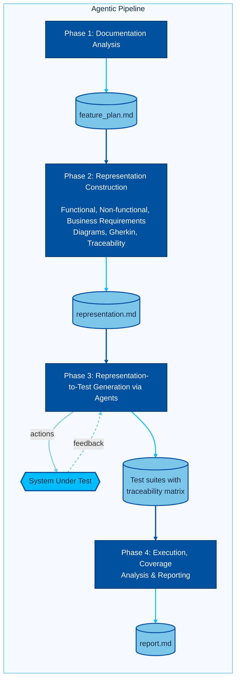

<div align="center">

<!-- BANNER -->


<!-- BADGES -->
<p align="center">
  
  
  
  
  
  
</p>

<p align="center">
  <b>A proof-of-concept four-phase agentic pipeline that transforms natural-language software documentation into executable Playwright integration tests — without reading a single line of source code.</b>
</p>

</div>


## What This Project Is

autotest-agent is a documentation-driven, LLM-assisted architecture for automated integration test generation. When formal, machine-readable API specifications are absent and only natural-language documentation describes system behavior, traditional automated testing tools fall short. This pipeline bridges that gap by employing large language models to extract structured requirements, construct formal intermediate representations, explore the live system empirically, and synthesize executable Playwright test suites grounded in observed behavior.

The prototype was implemented as an agentic workflow inside VS Code using GitHub Copilot and validated against the **AutoGPT platform** — an open-source AI agent builder whose capabilities are described through documentation rather than a machine-readable schema. The research project was submitted at the University of Stuttgart (Institute of Industrial Automation and Software Engineering) as FA 3910 under the supervison of Akshay Narla, M.Sc.


## Table of Contents

- [Key Learnings & Insights](#key-learnings--insights)
- [Features](#features)
- [Architecture Overview](#architecture-overview)
  - [Four-Phase Pipeline](#four-phase-pipeline)
  - [Prompt Evolution: Phase 3](#prompt-evolution-phase-3)
- [Evaluation Results](#evaluation-results)
- [Getting Started](#getting-started)
  - [Prerequisites](#prerequisites)
  - [Installation](#installation)
  - [Running the Pipeline](#running-the-pipeline)
- [Project Structure](#project-structure)
- [Tech Stack](#tech-stack)
- [Known Limitations](#known-limitations)
- [Related Repositories](#related-repositories)
- [License](#license)


## Key Learnings & Insights

- **Live system exploration is the single most consequential design decision.** Generating tests from documentation alone causes test cases to be filled with assumed selectors and unreachable navigation paths. Grounding every assertion in empirically observed system state via Playwright CLI eliminated this entire failure class.

- **Documentation describes intent. Implementation IS reality.** The LLM Agent discovered that the `AutoGPT delete-agent` feature is located on the Library page — not the Monitor Tab as documented. Every UI selector, button label, and navigation path in documentation must be verified against the live system before any test code is written.

- **Prompt effectiveness cannot be assumed to transfer across model families.** Claude Sonnet 4.6 achieved a 100% post-healing pass rate; Claude Opus 4.6 achieved 23%; GPT-5.3-Codex-Max achieved 0% — all from an identical prompt , in other words, Sonnet kept exploring after the documented path was blocked, Opus stopped at the blocked path, and Codex stopped entirely which suggests that the same prompt may not be effective across models and needs to be adapted according to model's behaviour.

- **Exploration strategy matters more than raw code generation capability** (given models are powerful enough for reasoning and tool calling). The behaviour of the agentic pipeline would be more deterministic and traceable if the exploration strategy were more rigidly defined, for example by specifying a fixed number of retries per step, a fixed set of fallback navigation paths, or a more structured decision tree for handling blocked paths.

- **The quality of the intermediate representation determines test quality downstream.** Representations that thoroughly capture edge cases, state transitions, and preconditions enable accurate planning. Incomplete or ambiguous representations lead to tests that assume impossible states or miss important behaviors.

- **Blocking is honest; failing is not.** Rather than writing 15 tests that assume a certain system state exists (e.g. an item in the database exists to test the delete functionality), the pipeline correctly classified 15 scenarios as BLOCKED with empirical evidence. A blocked test with a documented reason is far more useful than a passing testcase of minimal value.

- **Infrastructure caching (2-Day TTL) reduces token consumption and startup time.** The first analysis of test infrastructure is expensive. Caching the result and reusing it across sessions keeps both token usage and startup time under control for large, multi-feature projects.

- **Separation of concerns at the prompt level prevents LLM reinterpretation drift.** Assigning a single responsibility to each prompt file — documentation analysis, representation generation, test synthesis, execution reporting — ensures that downstream stages operate on fully specified, expert-reviewed artifacts rather than subtly different reinterpretations of the same source documentation.


## Features

- **Documentation-to-Representation Transformation** — Automatically extracts functional requirements, non-functional requirements, business rules, actors, preconditions, postconditions, and edge cases from plain-English documentation files, producing a fully traceable Requirements Traceability Matrix with unique IDs for every requirement.

- **Multi-Modal Formal Representations** — Generates Gherkin scenarios, activity flowcharts, state diagrams, and sequence diagrams in validated Mermaid syntax. Local Mermaid documentation is consulted before any diagram is created, eliminating the common failure mode where LLMs invent invalid syntax.

- **Live System Exploration via Playwright CLI** — The agent interacts directly with the running application using `playwright-cli` terminal commands before writing a single test assertion. Every click, form fill, and navigation step emits exact TypeScript code captured verbatim into a Code Bank file.

- **Evidence-Grounded Test Synthesis** — Test code is generated strictly from the Code Bank. No selector, navigation path, or API call appears in any test unless it was observed live. Speculative assertions are structurally prohibited.

- **State Dependency Analysis** — Each scenario receives an explicit precondition table before any code is written. Required system states are classified as existing fixture, global setup, API creation, UI creation, or impossible. Impossible preconditions mark their scenarios as BLOCKED with documented evidence.

- **Structured Healing Loop** — When a test fails, the agent re-opens Playwright CLI to re-explore the specific failing scenario, identifies the exact divergence point (wrong selector, missing wait, wrong URL), updates the evidence file, and fixes the code using only evidence from the updated file.

- **Infrastructure Analysis Caching** — Test infrastructure is analyzed once and cached with a 2-day TTL at `Resources/references/infrastructure-analysis.md`, avoiding redundant analysis across sessions and keeping token consumption bounded.

- **Documentation–Implementation Mismatch Detection** — The pipeline surfaces discrepancies between what documentation specifies and what the live system actually does. Nine such mismatches were identified across three AutoGPT features — all of them real, zero false positives.

- **Human-in-the-Loop Approval Gates** — Every major phase transition requires explicit human review before the next phase begins, preventing speculative reinterpretation drift across the pipeline.

- **Automated Execution Reports** — Phase 4 produces a stakeholder-ready findings report with per-test PASS/FAIL/SKIP/TIMEOUT/ERROR/BLOCKED status, full coverage traceability back to source requirements, and a validation subagent that independently verifies all counts and traceability entries before the report is finalized.


## Architecture Overview

### Four-Phase Pipeline

The pipeline enforces a strict single-responsibility principle at the prompt level. Each of the four `prompt.md` files assigns a specific QA engineering role to the LLM, defines mandatory execution phases, and specifies exactly what artifacts to consume and produce.



**`doc_to_dec.prompt.md`** receives one documentation file and produces a structured analysis. The agent extracts requirements from the documentation text and selects the most suitable intermediate representation with explicit justification. It is deliberately restricted from accessing source code — its only evidence is the documentation text supplied by the user.

**`dec_to_rep.prompt.md`** consumes the approved plan and generates the representation file. A critical rule governs this phase: the agent must consult the official Mermaid documentation stored in `Resources/mermaid/` before generating any diagram, treating Mermaid as a formal grammar rather than free text.

**`rep_to_testv4.prompt.md`** is the most elaborate prompt in the pipeline, structured around six mandatory gated stages. Stage 4a employs `playwright-cli` terminal commands to interact directly with the running application, capturing every emitted TypeScript code fragment into a Code Bank. Stage 4b synthesizes test files strictly from the Code Bank — no hand-written selectors or inferred assertions are permitted.

**`test_exec_report_gen.prompt.md`** runs the full Playwright test suite, assigns each test one of six statuses, identifies documentation-implementation mismatches by comparing documentation against live system behavior observed during execution, and launches a validation subagent to independently verify all counts before the report is written.

### Prompt Evolution: Phase 3

The Phase 3 prompt (`rep_to_test`) underwent four successive design iterations. Each version eliminated a specific failure class observed in the prior iteration.

| Version | Headline Change | Failure Eliminated |
|---|---|---|
| V1 | Infrastructure analysis + scenario extraction + test code generation | Tests using non-existent helpers, wrong Page Object methods, invented selectors |
| V2 | Added State Dependency Analysis and Executable Precondition Strategy as mandatory gated phases | Tests that assume preconditions exist without verifying or constructing them |
| V3 | Added mandatory live system exploration before any code synthesis; introduced "Documentation describes intent. Implementation IS reality." | Tests failing due to undocumented UI states, absent selectors, and navigation divergence |
| V4 | Replaced MCP browser tools with `playwright-cli` terminal commands; introduced the Code Bank pattern, Snapshot Protocol, Selector Convention Mapping, and Execution Gate | Tests using selectors observed during exploration but translated incorrectly into test code |


## Evaluation Results

The pipeline was evaluated against three AutoGPT features of increasing complexity using Claude Sonnet 4.6 as the primary model.

| Metric | `agent-blocks.md` | `create-basic-agent.md` | `delete-agent.md` |
|---|---|---|---|
| Total Requirements (FR + NFR + BR + EC) | 26 | 41 | 18 |
| Passing Test Cases Generated | 7 | 10 | 10 |
| Requirements Fully Covered | 9 (34%) | 29 (70.7%) | 13 (72.2%) |
| Blocked Tests (with empirical evidence) | 15 | 12 | 2 |
| Doc–Implementation Mismatches Found | 0 | 5 | 4 |
| Post-Healing Pass Rate | — | — | **100%** |
| Execution Time (Phase 1 + 2 + 3) | 3 + 3 + 25 min | 2 + 7 + 45 min | 2 + 3 + 30 min |
| Tokens Consumed (Phase 1 + 2 + 3) | 54k + 35.8k + 92.2k | 40.5k + 70.6k + 102k | 16.5k + 29.2k + 91.6k |

The nine documentation–implementation mismatches found across all features were real discrepancies. Zero false positives were reported across any feature.

**Model Comparison (delete-agent feature, identical prompt):**

| Metric | Claude Sonnet 4.6 | GPT-5.3-Codex-Max | Claude Opus 4.6 |
|---|---|---|---|
| Test Cases Generated | 10 | 2 | 13 |
| Post-Healing Pass Rate | **100%** | 0% | 23% (3 cases) |
| Bugs / Broken Behaviours Found | 1 | 1 | 2 |
| Blocked Tests (infeasible) | 0 | 2 | 10 |
| False Bug Reports | 0 | 0 | 0 |
| Phase 3 Token Consumption | 91.6k | 95.7k | 58.7k |

The divergence across models originated entirely in Phase 3 exploration strategy. When the Monitor Tab crashed and the documented delete flow became unreachable, Sonnet navigated to the Library page and discovered the actual implementation. Opus thoroughly documented the crash and attempted an API-level workaround but never questioned the documentation's premise. Codex stopped exploring entirely after two failed clicks and delivered only empty `test.skip()` bodies.


## Getting Started

### Prerequisites

The following software must be installed and available in the system PATH:

- Windows 10 or 11 (64-bit)
- Git 2.x or later
- Docker Desktop for Windows (with the Docker daemon running before the installer is launched)
- Node.js 18 or later (with `npm` and `npx`)
- VS Code with GitHub Copilot extension active
- PowerShell 5.1 or later (included with Windows 10/11)

The author's verified configuration: Git 2.47.0, npm/npx 10.9.4, Node 22.21.1, Docker 29.0.1, Windows 11.

### Installation

The `Installer/` directory contains three Windows batch scripts that fully automate environment setup. They handle repository cloning, Docker Compose startup, npm dependency installation, and Chromium browser download.

**Step 1.** Start Docker Desktop and wait until the Docker daemon is running.

**Step 2.** Open a Command Prompt or PowerShell terminal and navigate to the `Installer/` directory.

**Step 3.** Run the unified installer, substituting your preferred installation path:

```bat
setup-all.bat D:\myproject
```

Alternatively, double-click `setup-all.bat` and confirm the Docker readiness prompt. The script performs the following in order:

1. Clones the forked AutoGPT repository into `[target]/autogpt_codebase_rp`
2. Runs `docker compose up -d` from `autogpt_platform/`
3. Waits up to 20 seconds for `http://localhost:3000` to return HTTP 200
4. Clones the testing repository into `[target]/autogpt_agent_testcodegen`
5. Runs `npm install` (Playwright, TypeScript, Faker, dotenv, and related packages)
6. Runs `npx playwright install chromium`
7. Executes a smoke test against the live AutoGPT frontend to confirm a healthy environment

When the smoke test passes, a success popup appears. If any step fails, an error popup shows the failure category with a hint to inspect the logs.

Estimated total time: 12 to 25 minutes depending on network speed and Docker image cache state.

### Running the Pipeline

After installation, open the testing repository in VS Code and ensure GitHub Copilot is active. Use **Claude Sonnet 4.6** or an equivalent strong reasoning model. The four phases must be run in order; each phase requires the user to provide the correct input artifact as chat context.

**Phase 1 — Documentation Analysis**

```
/doc_to_dec
```
Add the target documentation file as context (e.g. `docs/content/platform/delete-agent.md`). The agent writes the plan to `plan/[feature].md` and requests review. Review and reply with approval to proceed.

**Phase 2 — Representation Construction**

```
/dec_to_rep
```
Add the approved plan file as context. The agent writes the representation to `representation/[feature].md` and requests review.

**Phase 3 — Test Case Generation**

```
/rep_to_testv4
```
Add the approved representation as context. Ensure AutoGPT is running at `http://localhost:3000`. The agent runs through all six gated stages, explores the live system with `playwright-cli`, generates the test suite, runs it, and applies the healing loop. Generated tests are written to `AutoGPT/tests/feature_[name]/`.

**Phase 4 — Execution Report**

```
/test_exec_report_gen
```
Add the generated test file, `coverage-report.md`, the representation document, and the original documentation as context. The agent executes the tests, parses results, and writes the final report to `report/execution-report-[feature]-[date].md`.


## Project Structure

```
autotest-agent/
│
├── Prompts/                          # Core intellectual contribution — four prompt.md files
│   ├── doc_to_dec.prompt.md          # Phase 1: Documentation Analysis → plan
│   ├── dec_to_rep.prompt.md          # Phase 2: Plan → Formal Representation
│   ├── rep_to_testv4.prompt.md       # Phase 3: Representation → Executable Tests (V4)
│   └── test_exec_report_gen.prompt.md # Phase 4: Execution & Coverage Report
│
├── Installer/                        # Windows batch scripts for automated environment setup
│   ├── setup-all.bat                 # Main entry point; calls both sub-scripts and smoke test
│   ├── setup-autogpt-runtime.bat     # Clones AutoGPT repo and starts Docker Compose
│   └── setup-testing-repo.bat        # Clones testing repo, runs npm install and Chromium install
│
├── Experiment-1/                     # Feature evaluation results (3 features, primary model)
│   ├── plan/                         # Phase 1 output — agent-blocks, create-basic-agent, delete-agent
│   ├── representation/               # Phase 2 output — multi-modal representations per feature
│   └── testcases/
│       ├── feature_agent_blocks/     # agent-blocks-core.spec.ts + coverage-report.md
│       └── feature_create_basic_agent/ # create-basic-agent.spec.ts + coverage-report.md
│
├── Experiment-2/                     # Model comparison results (delete-agent, 3 models)
│   ├── Claudesonnet/                 # Claude Sonnet 4.6 — representation, tests, references
│   ├── codex/                        # GPT-5.3-Codex-Max — decision files, execution report, tests
│   └── opus4.6/                      # Claude Opus 4.6 — representation, execution report, plan
│
├── Test_Explore/                     # Full testing workspace (git submodule references)
│   ├── autogpt_agent_testcodegen/    # Testing repository: docs, resources, Playwright config
│   └── autogpt_codebase_rp/          # Forked AutoGPT codebase snapshot
│
├── Sample Interaction Log/
│   └── rep_to_test.md               # Sample Phase 3 interaction log (GPT-5.3-Codex-Max)
│
├── ResearchProjectPresentation.pptx  # Final thesis presentation slides
├── .gitmodules                        # Submodule references for testing and AutoGPT repos
└── README.md
```

**Testing Repository internal layout** (inside `autogpt_agent_testcodegen/`):

```
autogpt_agent_testcodegen/
│
├── .github/
│   └── prompts/                      # All four prompt.md files (VS Code activation targets)
│       └── skills/playwright-cli/    # SKILL.md replacing Playwright MCP with CLI commands
│
├── AutoGPT/
│   ├── lib/                          # Frontend utility code (Page Objects, selectors, auth)
│   └── tests/                        # Generated test suites per feature
│       └── feature_[name]/
│
├── docs/                             # AutoGPT natural-language documentation (pipeline input)
│
├── Resources/
│   ├── mermaid/                      # Local Mermaid syntax docs (flowchart, sequence, state, req)
│   ├── references/                   # Cached infrastructure analysis (2-day TTL)
│   └── tests/                        # Read-only reference copy of AutoGPT's original test suite
│
├── plan/                             # Phase 1 output artifacts
├── representation/                   # Phase 2 output artifacts
├── report/                           # Phase 4 execution reports
│
├── playwright.config.ts
├── package.json
└── tsconfig.json
```


## Tech Stack

| Component | Technology | Purpose |
|---|---|---|
| LLM Agent Framework | VS Code GitHub Copilot (`prompt.md`) | Orchestrates all four pipeline phases |
| Browser Automation | Playwright + `playwright-cli` | Live system exploration and test execution |
| Test Language | TypeScript | Generated integration test suites |
| System Under Test | AutoGPT (Docker Compose) | Open-source AI agent builder on `localhost:3000` |
| Package Management | npm / npx | Dependency installation and test runner invocation |
| Installer | Windows Batch Scripts | Automated environment setup |
| Primary Model | Claude Sonnet 4.6 | Recommended model for all four pipeline phases |


## Known Limitations

**Monitor Tab crash** — The AutoGPT Monitor Tab throws a `TypeError: Cannot read properties of null (reading 'properties')` when any agent row is clicked. The pipeline's live exploration phase detects this automatically and locates features on alternative pages. This is a known defect in the AutoGPT fork used as the system under test.

**Complex precondition states** — Features that require multi-agent workspace setup (such as `agent-blocks`) produce a high percentage of blocked tests (58% in the evaluation). This is an infrastructure constraint, not a pipeline failure. Addressing it would require dedicated test data seeding utilities outside the pipeline's current scope.

**Model sensitivity** — The V4 prompt was designed for and evaluated primarily with Claude Sonnet 4.6. Other models produce significantly different results in Phase 3 due to differences in how they handle uncertainty when the documented UI path is blocked.

**Windows-only installer** — The batch scripts target Windows. Running the pipeline on Linux or macOS is possible but requires manual repository cloning and `npm install` steps. Docker Compose startup commands are platform-agnostic.

**Context window ceiling** — Phase 3 consumes up to 91–102k tokens per feature run. The effective upper bound for feature complexity is determined by the context window available to the active model in GitHub Copilot (160k tokens for Claude Sonnet 4.6 in the evaluated configuration).


## Related Repositories

| Repository | Description |
|---|---|
| [autogpt_agent_testcodegen](https://github.com/ayushmittalde/autogpt_agent_testcodegen) | Testing repository — prompts, generated tests, docs, resources, and Playwright config |
| [autogpt_codebase_rp](https://github.com/ayushmittalde/autogpt_codebase_rp) | Forked AutoGPT platform — the system under test deployed via Docker Compose |


## License

No explicit open-source licence is applied at the project level. This repository contains artifacts from a University of Stuttgart research project (FA 3910). If you adapt or redistribute any content, ensure compliance with the licences of all transitive dependencies through the npm and Playwright dependency trees.


<div align="center">


*University of Stuttgart · Institute of Industrial Automation and Software Engineering · FA 3910*

*Ayush Mittal · Supervisor: Akshay Narla, M.Sc. · Examiner: Prof. Dr.-Ing. Dr. h. c. Michael Weyrich*

</div>