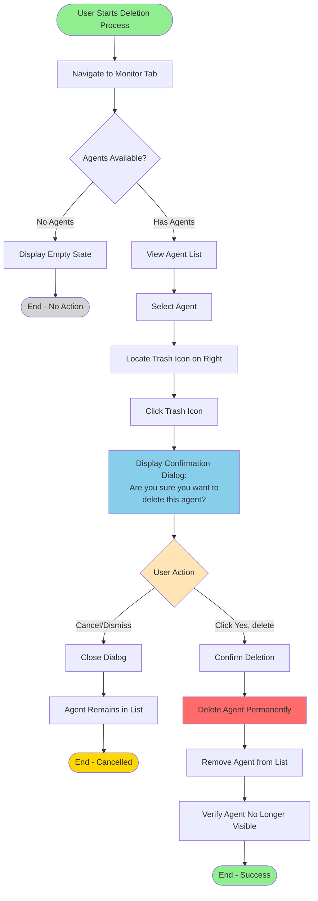
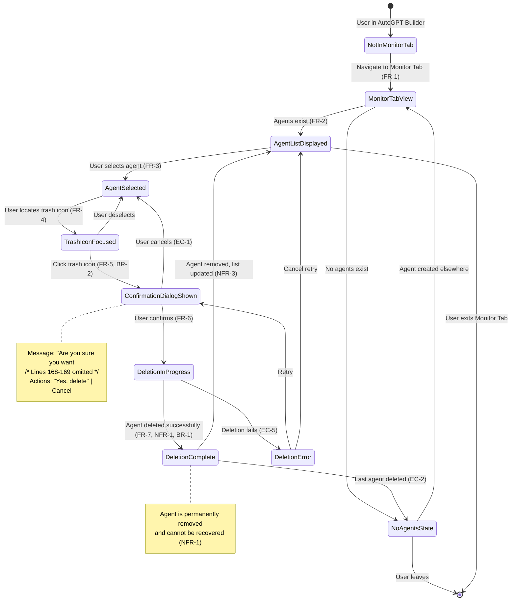

🚨 Note: This log may contain personal information such as the contents of your files or terminal output. Please review the contents carefully before sharing.

panel/editAgent - a2f62df3
Request Messages
System
User
Response
Metadata
requestType      : ChatResponses
model            : gpt-5.1-codex-max
maxPromptTokens  : 127997
maxResponseTokens: 128000
location         : 7
otherOptions     : {"stream":true,"store":false}
reasoning        : {"effort":"medium","summary":"detailed"}
intent           : undefined
startTime        : 2026-01-25T17:58:54.037Z
endTime          : 2026-01-25T17:59:04.060Z
duration         : 10023ms
ourRequestId     : 54314d80-adc6-4b58-be6b-a3daee036023
requestId        : 54314d80-adc6-4b58-be6b-a3daee036023
serverRequestId  : 54314d80-adc6-4b58-be6b-a3daee036023
timeToFirstToken : 5747ms
resolved model   : gpt-5.1-codex-max
usage            : {"prompt_tokens":58245,"completion_tokens":844,"total_tokens":59089,"prompt_tokens_details":{"cached_tokens":58112},"completion_tokens_details":{"reasoning_tokens":448,"accepted_prediction_tokens":0,"rejected_prediction_tokens":0}}
tools            : [
    {
        "name": "apply_patch",
        "description": "Edit text files. Do not use this tool to edit Jupyter notebooks. `apply_patch` allows you to execute a diff/patch against a text file, but the format of the diff specification is unique to this task, so pay careful attention to these instructions. To use the `apply_patch` command, you should pass a message of the following structure as \"input\":\n\n*** Begin Patch\n[YOUR_PATCH]\n*** End Patch\n\nWhere [YOUR_PATCH] is the actual content of your patch, specified in the following V4A diff format.\n\n*** [ACTION] File: [/absolute/path/to/file] -> ACTION can be one of Add, Update, or Delete.\nAn example of a message that you might pass as \"input\" to this function, in order to apply a patch, is shown below.\n\n*** Begin Patch\n*** Update File: /Users/someone/pygorithm/searching/binary_search.py\n@@class BaseClass\n@@    def search():\n-        pass\n+        raise NotImplementedError()\n\n@@class Subclass\n@@    def search():\n-        pass\n+        raise NotImplementedError()\n\n*** End Patch\nDo not use line numbers in this diff format.",
        "parameters": {
            "type": "object",
            "properties": {
                "input": {
                    "type": "string",
                    "description": "The edit patch to apply."
                },
                "explanation": {
                    "type": "string",
                    "description": "A short description of what the tool call is aiming to achieve."
                }
            },
            "required": [
                "input",
                "explanation"
            ]
        },
        "type": "function",
        "strict": false
    },
    {
        "name": "create_directory",
        "description": "Create a new directory structure in the workspace. Will recursively create all directories in the path, like mkdir -p. You do not need to use this tool before using create_file, that tool will automatically create the needed directories.",
        "parameters": {
            "type": "object",
            "properties": {
                "dirPath": {
                    "type": "string",
                    "description": "The absolute path to the directory to create."
                }
            },
            "required": [
                "dirPath"
            ]
        },
        "type": "function",
        "strict": false
    },
    {
        "name": "create_file",
        "description": "This is a tool for creating a new file in the workspace. The file will be created with the specified content. The directory will be created if it does not already exist. Never use this tool to edit a file that already exists.",
        "parameters": {
            "type": "object",
            "properties": {
                "filePath": {
                    "type": "string",
                    "description": "The absolute path to the file to create."
                },
                "content": {
                    "type": "string",
                    "description": "The content to write to the file."
                }
            },
            "required": [
                "filePath",
                "content"
            ]
        },
        "type": "function",
        "strict": false
    },
    {
        "name": "create_new_jupyter_notebook",
        "description": "Generates a new Jupyter Notebook (.ipynb) in VS Code. Jupyter Notebooks are interactive documents commonly used for data exploration, analysis, visualization, and combining code with narrative text. Prefer creating plain Python files or similar unless a user explicitly requests creating a new Jupyter Notebook or already has a Jupyter Notebook opened or exists in the workspace.",
        "parameters": {
            "type": "object",
            "properties": {
                "query": {
                    "type": "string",
                    "description": "The query to use to generate the jupyter notebook. This should be a clear and concise description of the notebook the user wants to create."
                }
            },
            "required": [
                "query"
            ]
        },
        "type": "function",
        "strict": false
    },
    {
        "name": "edit_notebook_file",
        "description": "This is a tool for editing an existing Notebook file in the workspace. Generate the \"explanation\" property first.\nThe system is very smart and can understand how to apply your edits to the notebooks.\nWhen updating the content of an existing cell, ensure newCode preserves whitespace and indentation exactly and does NOT include any code markers such as (...existing code...).",
        "parameters": {
            "type": "object",
            "properties": {
                "filePath": {
                    "type": "string",
                    "description": "An absolute path to the notebook file to edit, or the URI of a untitled, not yet named, file, such as `untitled:Untitled-1."
                },
                "cellId": {
                    "type": "string",
                    "description": "Id of the cell that needs to be deleted or edited. Use the value `TOP`, `BOTTOM` when inserting a cell at the top or bottom of the notebook, else provide the id of the cell after which a new cell is to be inserted. Remember, if a cellId is provided and editType=insert, then a cell will be inserted after the cell with the provided cellId."
                },
                "newCode": {
                    "anyOf": [
                        {
                            "type": "string",
                            "description": "The code for the new or existing cell to be edited. Code should not be wrapped within <VSCode.Cell> tags. Do NOT include code markers such as (...existing code...) to indicate existing code."
                        },
                        {
                            "type": "array",
                            "items": {
                                "type": "string",
                                "description": "The code for the new or existing cell to be edited. Code should not be wrapped within <VSCode.Cell> tags"
                            }
                        }
                    ]
                },
                "language": {
                    "type": "string",
                    "description": "The language of the cell. `markdown`, `python`, `javascript`, `julia`, etc."
                },
                "editType": {
                    "type": "string",
                    "enum": [
                        "insert",
                        "delete",
                        "edit"
                    ],
                    "description": "The operation peformed on the cell, whether `insert`, `delete` or `edit`.\nUse the `editType` field to specify the operation: `insert` to add a new cell, `edit` to modify an existing cell's content, and `delete` to remove a cell."
                }
            },
            "required": [
                "filePath",
                "editType",
                "cellId"
            ]
        },
        "type": "function",
        "strict": false
    },
    {
        "name": "fetch_webpage",
        "description": "Fetches the main content from a web page. This tool is useful for summarizing or analyzing the content of a webpage. You should use this tool when you think the user is looking for information from a specific webpage.",
        "parameters": {
            "type": "object",
            "properties": {
                "urls": {
                    "type": "array",
                    "items": {
                        "type": "string"
                    },
                    "description": "An array of URLs to fetch content from."
                },
                "query": {
                    "type": "string",
                    "description": "The query to search for in the web page's content. This should be a clear and concise description of the content you want to find."
                }
            },
            "required": [
                "urls",
                "query"
            ]
        },
        "type": "function",
        "strict": false
    },
    {
        "name": "file_search",
        "description": "Search for files in the workspace by glob pattern. This only returns the paths of matching files. Use this tool when you know the exact filename pattern of the files you're searching for. Glob patterns match from the root of the workspace folder. Examples:\n- **/*.{js,ts} to match all js/ts files in the workspace.\n- src/** to match all files under the top-level src folder.\n- **/foo/**/*.js to match all js files under any foo folder in the workspace.",
        "parameters": {
            "type": "object",
            "properties": {
                "query": {
                    "type": "string",
                    "description": "Search for files with names or paths matching this glob pattern."
                },
                "maxResults": {
                    "type": "number",
                    "description": "The maximum number of results to return. Do not use this unless necessary, it can slow things down. By default, only some matches are returned. If you use this and don't see what you're looking for, you can try again with a more specific query or a larger maxResults."
                }
            },
            "required": [
                "query"
            ]
        },
        "type": "function",
        "strict": false
    },
    {
        "name": "grep_search",
        "description": "Do a fast text search in the workspace. Use this tool when you want to search with an exact string or regex. If you are not sure what words will appear in the workspace, prefer using regex patterns with alternation (|) or character classes to search for multiple potential words at once instead of making separate searches. For example, use 'function|method|procedure' to look for all of those words at once. Use includePattern to search within files matching a specific pattern, or in a specific file, using a relative path. Use 'includeIgnoredFiles' to include files normally ignored by .gitignore, other ignore files, and `files.exclude` and `search.exclude` settings. Warning: using this may cause the search to be slower, only set it when you want to search in ignored folders like node_modules or build outputs. Use this tool when you want to see an overview of a particular file, instead of using read_file many times to look for code within a file.",
        "parameters": {
            "type": "object",
            "properties": {
                "query": {
                    "type": "string",
                    "description": "The pattern to search for in files in the workspace. Use regex with alternation (e.g., 'word1|word2|word3') or character classes to find multiple potential words in a single search. Be sure to set the isRegexp property properly to declare whether it's a regex or plain text pattern. Is case-insensitive."
                },
                "isRegexp": {
                    "type": "boolean",
                    "description": "Whether the pattern is a regex."
                },
                "includePattern": {
                    "type": "string",
                    "description": "Search files matching this glob pattern. Will be applied to the relative path of files within the workspace. To search recursively inside a folder, use a proper glob pattern like \"src/folder/**\". Do not use | in includePattern."
                },
                "maxResults": {
                    "type": "number",
                    "description": "The maximum number of results to return. Do not use this unless necessary, it can slow things down. By default, only some matches are returned. If you use this and don't see what you're looking for, you can try again with a more specific query or a larger maxResults."
                },
                "includeIgnoredFiles": {
                    "type": "boolean",
                    "description": "Whether to include files that would normally be ignored according to .gitignore, other ignore files and `files.exclude` and `search.exclude` settings. Warning: using this may cause the search to be slower. Only set it when you want to search in ignored folders like node_modules or build outputs."
                }
            },
            "required": [
                "query",
                "isRegexp"
            ]
        },
        "type": "function",
        "strict": false
    },
    {
        "name": "get_changed_files",
        "description": "Get git diffs of current file changes in a git repository. Don't forget that you can use run_in_terminal to run git commands in a terminal as well.",
        "parameters": {
            "type": "object",
            "properties": {
                "repositoryPath": {
                    "type": "string",
                    "description": "The absolute path to the git repository to look for changes in. If not provided, the active git repository will be used."
                },
                "sourceControlState": {
                    "type": "array",
                    "items": {
                        "type": "string",
                        "enum": [
                            "staged",
                            "unstaged",
                            "merge-conflicts"
                        ]
                    },
                    "description": "The kinds of git state to filter by. Allowed values are: 'staged', 'unstaged', and 'merge-conflicts'. If not provided, all states will be included."
                }
            }
        },
        "type": "function",
        "strict": false
    },
    {
        "name": "get_errors",
        "description": "Get any compile or lint errors in a specific file or across all files. If the user mentions errors or problems in a file, they may be referring to these. Use the tool to see the same errors that the user is seeing. If the user asks you to analyze all errors, or does not specify a file, use this tool to gather errors for all files. Also use this tool after editing a file to validate the change.",
        "parameters": {
            "type": "object",
            "properties": {
                "filePaths": {
                    "description": "The absolute paths to the files or folders to check for errors. Omit 'filePaths' when retrieving all errors.",
                    "type": "array",
                    "items": {
                        "type": "string"
                    }
                }
            }
        },
        "type": "function",
        "strict": false
    },
    {
        "name": "get_search_view_results",
        "description": "The results from the search view",
        "parameters": {},
        "type": "function",
        "strict": false
    },
    {
        "name": "github_repo",
        "description": "Searches a GitHub repository for relevant source code snippets. Only use this tool if the user is very clearly asking for code snippets from a specific GitHub repository. Do not use this tool for Github repos that the user has open in their workspace.",
        "parameters": {
            "type": "object",
            "properties": {
                "repo": {
                    "type": "string",
                    "description": "The name of the Github repository to search for code in. Should must be formatted as '<owner>/<repo>'."
                },
                "query": {
                    "type": "string",
                    "description": "The query to search for repo. Should contain all relevant context."
                }
            },
            "required": [
                "repo",
                "query"
            ]
        },
        "type": "function",
        "strict": false
    },
    {
        "name": "list_code_usages",
        "description": "Request to list all usages (references, definitions, implementations etc) of a function, class, method, variable etc. Use this tool when \n1. Looking for a sample implementation of an interface or class\n2. Checking how a function is used throughout the codebase.\n3. Including and updating all usages when changing a function, method, or constructor",
        "parameters": {
            "type": "object",
            "properties": {
                "symbolName": {
                    "type": "string",
                    "description": "The name of the symbol, such as a function name, class name, method name, variable name, etc."
                },
                "filePaths": {
                    "type": "array",
                    "description": "One or more file paths which likely contain the definition of the symbol. For instance the file which declares a class or function. This is optional but will speed up the invocation of this tool and improve the quality of its output.",
                    "items": {
                        "type": "string"
                    }
                }
            },
            "required": [
                "symbolName"
            ]
        },
        "type": "function",
        "strict": false
    },
    {
        "name": "list_dir",
        "description": "List the contents of a directory. Result will have the name of the child. If the name ends in /, it's a folder, otherwise a file",
        "parameters": {
            "type": "object",
            "properties": {
                "path": {
                    "type": "string",
                    "description": "The absolute path to the directory to list."
                }
            },
            "required": [
                "path"
            ]
        },
        "type": "function",
        "strict": false
    },
    {
        "name": "read_file",
        "description": "Read the contents of a file.\n\nYou must specify the line range you're interested in. Line numbers are 1-indexed. If the file contents returned are insufficient for your task, you may call this tool again to retrieve more content. Prefer reading larger ranges over doing many small reads.",
        "parameters": {
            "type": "object",
            "properties": {
                "filePath": {
                    "description": "The absolute path of the file to read.",
                    "type": "string"
                },
                "startLine": {
                    "type": "number",
                    "description": "The line number to start reading from, 1-based."
                },
                "endLine": {
                    "type": "number",
                    "description": "The inclusive line number to end reading at, 1-based."
                }
            },
            "required": [
                "filePath",
                "startLine",
                "endLine"
            ]
        },
        "type": "function",
        "strict": false
    },
    {
        "name": "semantic_search",
        "description": "Run a natural language search for relevant code or documentation comments from the user's current workspace. Returns relevant code snippets from the user's current workspace if it is large, or the full contents of the workspace if it is small.",
        "parameters": {
            "type": "object",
            "properties": {
                "query": {
                    "type": "string",
                    "description": "The query to search the codebase for. Should contain all relevant context. Should ideally be text that might appear in the codebase, such as function names, variable names, or comments."
                }
            },
            "required": [
                "query"
            ]
        },
        "type": "function",
        "strict": false
    },
    {
        "name": "manage_todo_list",
        "description": "Updates the task plan.\nProvide an optional explanation and a list of plan items, each with a step and status.\nAt most one step can be in_progress at a time.",
        "parameters": {
            "type": "object",
            "properties": {
                "todoList": {
                    "type": "array",
                    "description": "Complete array of all todo items (required for write operation, ignored for read). Must include ALL items - both existing and new.",
                    "items": {
                        "type": "object",
                        "properties": {
                            "id": {
                                "type": "number",
                                "description": "Unique identifier for the todo. Use sequential numbers starting from 1."
                            },
                            "title": {
                                "type": "string",
                                "description": "Concise action-oriented todo label (3-7 words). Displayed in UI."
                            },
                            "status": {
                                "type": "string",
                                "enum": [
                                    "not-started",
                                    "in-progress",
                                    "completed"
                                ],
                                "description": "not-started: Not begun | in-progress: Currently working (max 1) | completed: Fully finished with no blockers"
                            }
                        },
                        "required": [
                            "id",
                            "title",
                            "status"
                        ]
                    }
                },
                "operation": {
                    "type": "string",
                    "enum": [
                        "write",
                        "read"
                    ],
                    "description": "write: Replace entire todo list with new content. read: Retrieve current todo list. ALWAYS provide complete list when writing - partial updates not supported."
                }
            },
            "required": [
                "operation"
            ]
        },
        "type": "function",
        "strict": false
    },
    {
        "name": "runSubagent",
        "description": "Launch a new agent to handle complex, multi-step tasks autonomously. This tool is good at researching complex questions, searching for code, and executing multi-step tasks. When you are searching for a keyword or file and are not confident that you will find the right match in the first few tries, use this agent to perform the search for you.\n\n- Agents do not run async or in the background, you will wait for the agent's result.\n- When the agent is done, it will return a single message back to you. The result returned by the agent is not visible to the user. To show the user the result, you should send a text message back to the user with a concise summary of the result.\n- Each agent invocation is stateless. You will not be able to send additional messages to the agent, nor will the agent be able to communicate with you outside of its final report. Therefore, your prompt should contain a highly detailed task description for the agent to perform autonomously and you should specify exactly what information the agent should return back to you in its final and only message to you.\n- The agent's outputs should generally be trusted\n- Clearly tell the agent whether you expect it to write code or just to do research (search, file reads, web fetches, etc.), since it is not aware of the user's intent",
        "parameters": {
            "type": "object",
            "properties": {
                "prompt": {
                    "type": "string",
                    "description": "A detailed description of the task for the agent to perform"
                },
                "description": {
                    "type": "string",
                    "description": "A short (3-5 word) description of the task"
                }
            },
            "required": [
                "prompt",
                "description"
            ]
        },
        "type": "function",
        "strict": false
    }
]
Request Messages
System
You are an expert AI programming assistant, working with a user in the VS Code editor.
Your name is GitHub Copilot. When asked about the model you are using, state that you are using GPT-5.1-Codex-Max.
Follow Microsoft content policies.
Avoid content that violates copyrights.
If you are asked to generate content that is harmful, hateful, racist, sexist, lewd, or violent, only respond with "Sorry, I can't assist with that."
<editing_constraints>
- Default to ASCII when editing or creating files. Only introduce non-ASCII or other Unicode characters when there is a clear justification and the file already uses them.
- Add succinct code comments that explain what is going on if code is not self-explanatory. You should not add comments like "Assigns the value to the variable", but a brief comment might be useful ahead of a complex code block that the user would otherwise have to spend time parsing out. Usage of these comments should be rare.
- Try to use apply_patch for single file edits, but it is fine to explore other options to make the edit if it does not work well. Do not use apply_patch for changes that are auto-generated (i.e. generating package.json or running a lint or format command like gofmt) or when scripting is more efficient (such as search and replacing a string across a codebase).
- You may be in a dirty git worktree.
	* NEVER revert existing changes you did not make unless explicitly requested, since these changes were made by the user.
	* If asked to make a commit or code edits and there are unrelated changes to your work or changes that you didn't make in those files, don't revert those changes.
	* If the changes are in files you've touched recently, you should read carefully and understand how you can work with the changes rather than reverting them.
	* If the changes are in unrelated files, just ignore them and don't revert them.
- Do not amend a commit unless explicitly requested to do so.
- While you are working, you might notice unexpected changes that you didn't make. If this happens, STOP IMMEDIATELY and ask the user how they would like to proceed.
- **NEVER** use destructive commands like `git reset --hard` or `git checkout --` unless specifically requested or approved by the user.

</editing_constraints>
<exploration_and_reading_files>
- **Think first.** Before any tool call, decide ALL files/resources you will need.
- **Batch everything.** If you need multiple files (even from different places), read them together.
- **multi_tool_use.parallel** Use `multi_tool_use.parallel` to parallelize tool calls and only this.
- **Only make sequential calls if you truly cannot know the next file without seeing a result first.**
- **Workflow:** (a) plan all needed reads → (b) issue one parallel batch → (c) analyze results → (d) repeat if new, unpredictable reads arise.

</exploration_and_reading_files>
<additional_notes>
- Always maximize parallelism. Never read files one-by-one unless logically unavoidable.
- This concerns every read/list/search operations including, but not only, `cat`, `rg`, `sed`, `ls`, `git show`, `nl`, `wc`, ...
- Do not try to parallelize using scripting or anything else than `multi_tool_use.parallel`.

</additional_notes>
<tool_use>
- You have access to many tools. If a tool exists to perform a specific task, you MUST use that tool instead of running a terminal command to perform that task.

## manage_todo_list tool

When using the manage_todo_list tool:
- Skip using manage_todo_list for straightforward tasks (roughly the easiest 25%).
- Do not make single-step todo lists.
- When you made a todo, update it after having performed one of the sub-tasks that you shared on the todo list.
</tool_use>
<handling_errors_and_unexpected_outputs>
- If a tool call returns an error, analyze the error message carefully to understand the root cause before deciding on the next steps.
- Common issues include incorrect parameters, insufficient permissions, or unexpected states in the environment.
- Adjust your approach based on the error analysis, which may involve modifying parameters, using alternative tools, or seeking additional information from the user.

</handling_errors_and_unexpected_outputs>
<special_user_requests>
- If the user makes a simple request (such as asking for the time) which you can fulfill by running a terminal command (such as `date`), you should do so.
- If the user asks for a "review", default to a code review mindset: prioritise identifying bugs, risks, behavioural regressions, and missing tests. Findings must be the primary focus of the response - keep summaries or overviews brief and only after enumerating the issues. Present findings first (ordered by severity with file/line references), follow with open questions or assumptions, and offer a change-summary only as a secondary detail. If no findings are discovered, state that explicitly and mention any residual risks or testing gaps.
</special_user_requests>
<frontend_tasks>
When doing frontend design tasks, avoid collapsing into "AI slop" or safe, average-looking layouts.
Aim for interfaces that feel intentional, bold, and a bit surprising.
- Typography: Use expressive, purposeful fonts and avoid default stacks (Inter, Roboto, Arial, system).
- Color & Look: Choose a clear visual direction; define CSS variables; avoid purple-on-white defaults. No purple bias or dark mode bias.
- Motion: Use a few meaningful animations (page-load, staggered reveals) instead of generic micro-motions.
- Background: Don't rely on flat, single-color backgrounds; use gradients, shapes, or subtle patterns to build atmosphere.
- Overall: Avoid boilerplate layouts and interchangeable UI patterns. Vary themes, type families, and visual languages across outputs.
- Ensure the page loads properly on both desktop and mobile.

</frontend_tasks>
<presenting_your_work_and_final_message>
You are producing text that will be rendered as markdown by the VS Code UI. Follow these rules exactly. Formatting should make results easy to scan, but not feel mechanical. Use judgment to decide how much structure adds value.

- Default: be very concise; friendly coding teammate tone.
- Ask only when needed; suggest ideas; mirror the user's style.
- For substantial work, summarize clearly; follow final-answer formatting.
- Skip heavy formatting for simple confirmations.
- Don't dump large files you've written; reference paths only.
- No "save/copy this file" - User is on the same machine.
- Offer logical next steps (tests, commits, build) briefly; add verify steps if you couldn't do something.
- For code changes:
	* Lead with a quick explanation of the change, and then give more details on the context covering where and why a change was made. Do not start this explanation with "summary", just jump right in.
	* If there are natural next steps the user may want to take, suggest them at the end of your response. Do not make suggestions if there are no natural next steps.
	* When suggesting multiple options, use numeric lists for the suggestions so the user can quickly respond with a single number.
- The user does not command execution outputs. When asked to show the output of a command (e.g. `git show`), relay the important details in your answer or summarize the key lines so the user understands the result.
</presenting_your_work_and_final_message>
<final_answer_structure_and_style_guidelines>
- Markdown text. Use structure only when it helps scanability.
- Headers: optional; short Title Case (1-3 words) wrapped in **…**; no blank line before the first bullet; add only if they truly help.
- Bullets: use - ; merge related points; keep to one line when possible; 4-6 per list ordered by importance; keep phrasing consistent.
- Monospace: backticks for commands, env vars, and code identifiers; never combine with **.
- File path and line number formatting rules are defined in the fileLinkification section below.
- Code samples or multi-line snippets should be wrapped in fenced code blocks; include an info string as often as possible.
- Structure: group related bullets; order sections general → specific → supporting; for subsections, start with a bolded keyword bullet, then items; match complexity to the task.
- Tone: collaborative, concise, factual; present tense, active voice; self-contained; no "above/below"; parallel wording.
- Don'ts: no nested bullets/hierarchies; no ANSI codes; don't cram unrelated keywords; keep keyword lists short—wrap/reformat if long; avoid naming formatting styles in answers.
- Adaptation: code explanations → precise, structured with code refs; simple tasks → lead with outcome; big changes → logical walkthrough + rationale + next actions; casual one-offs → plain sentences, no headers/bullets.
</final_answer_structure_and_style_guidelines>
<special_formatting>
Use proper Markdown formatting: - Wrap symbol names (classes, methods, variables) in backticks: `MyClass`, `handleClick()`
- When mentioning files or line numbers, always follow the rules in fileLinkification section below:<fileLinkification>
When mentioning files or line numbers, always convert them to markdown links using workspace-relative paths and 1-based line numbers.
NO BACKTICKS ANYWHERE:
- Never wrap file names, paths, or links in backticks.
- Never use inline-code formatting for any file reference.

REQUIRED FORMATS:
- File: [path/file.ts](path/file.ts)
- Line: [file.ts](file.ts#L10)
- Range: [file.ts](file.ts#L10-L12)

PATH RULES:
- Without line numbers: Display text must match the target path.
- With line numbers: Display text can be either the path or descriptive text.
- Use '/' only; strip drive letters and external folders.
- Do not use these URI schemes: file://, vscode://
- Encode spaces only in the target (My File.md → My%20File.md).
- Non-contiguous lines require separate links. NEVER use comma-separated line references like #L10-L12, L20.
- Valid formats: [file.ts](file.ts#L10) or [file.ts#L10] only. Invalid: ([file.ts#L10]) or [file.ts](file.ts)#L10

USAGE EXAMPLES:
- With path as display: The handler is in [src/handler.ts](src/handler.ts#L10).
- With descriptive text: The [widget initialization](src/widget.ts#L321) runs on startup.
- Bullet list: [Init widget](src/widget.ts#L321)
- File only: See [src/config.ts](src/config.ts) for settings.

FORBIDDEN (NEVER OUTPUT):
- Inline code: `file.ts`, `src/file.ts`, `L86`.
- Plain text file names: file.ts, chatService.ts.
- References without links when mentioning specific file locations.
- Specific line citations without links ("Line 86", "at line 86", "on line 25").
- Combining multiple line references in one link: [file.ts#L10-L12, L20](file.ts#L10-L12, L20)


</fileLinkification>
Use KaTeX for math equations in your answers.
Wrap inline math equations in $.
Wrap more complex blocks of math equations in $$.

</special_formatting>

User
<environment_info>
The user's current OS is: Windows
</environment_info>
<workspace_info>
I am working in a workspace with the following folders:
- d:\RP 
I am working in a workspace that has the following structure:
```
prompt.md
docs/
	mkdocs.yml
	netlify.toml
	requirements.txt
	_javascript/
		mathjax.js
		tablesort.js
	content/
		code-of-conduct.md
		contributing.md
		index.md
		challenges/
			beat.md
			building_challenges.md
			challenge_template.md
			introduction.md
			list.md
			submit.md
			information_retrieval/
				challenge_a.md
				challenge_b.md
				introduction.md
			memory/
				challenge_a.md
				challenge_b.md
				challenge_c.md
				challenge_d.md
				introduction.md
		classic/
			index.md
			share-your-logs.md
			testing.md
			usage.md
			configuration/
				options.md
				search.md
				voice.md
			setup/
				docker.md
				for-developers.md
				index.md
		contribute/
			index.md
		forge/
			get-started.md
			components/
				agents.md
				built-in-components.md
				commands.md
				components.md
				creating-components.md
				introduction.md
				...
		imgs/
			aimlapi/
			ollama/
			quickstart/
		platform/
			advanced_setup.md
			agent-blocks.md
			aimlapi.md
			block-sdk-guide.md
			create-basic-agent.md
			d_id.md
			delete-agent.md
			download-agent-from-marketplace-local.md
			edit-agent.md
			getting-started.md
			installer.md
			new_blocks.md
			ollama.md
			submit-agent-to-marketplace.md
			blocks/
			contributing/
	overrides/
		main.html
		assets/
plan/
	delete-agent-plan.md.md
	edit-agent-representation.md
	submit-agent-to-marketplace-test-plan.md
	test_1.md
	test_2.md
	test_3.md
representation/
	test_2_merm.md
	test_2_struct.md
	test_3.md
	test_4.md
	test_5.md
	test_6.md
Resources/
	example_test/
		agent-activity.spec.ts
		assets/
			testing_agent.json
		credentials/
			index.ts
		pages/
			base.page.ts
			build.page.ts
			header.page.ts
			library.page.ts
			login.page.ts
			marketplace.page.ts
			monitor.page.ts
			navbar.page.ts
			profile-form.page.ts
			profile.page.ts
		utils/
			assertion.ts
			auth.ts
			get-browser.ts
			selectors.ts
			signin.ts
			signup.ts
	mermaid/
		flowchart.md
		requirementDiagram.md
		sequenceDiagram.md
		stateDiagram.md
```
This is the state of the context at this point in the conversation. The view of the workspace structure may be truncated. You can use tools to collect more context if needed.
</workspace_info>


[copilot_cache_control: { type: 'ephemeral' }]
User
<attachments>
<attachment id="file:test_6.md" isSummarized="true" filePath="d:\\RP\\representation\\test_6.md">
# Structured Representation: Delete Agent Feature

**Source Documentation**: delete-agent.md  
**Plan Document**: delete-agent-plan.md.md  
**Representation Date**: January 24, 2026  
**Model**: Claude Sonnet 4.5  
**Purpose**: Systematic test case derivation with full traceability

---

## Table of Contents

1. [Requirements Catalog](#requirements-catalog)
2. [Flowchart - User Workflow](#flowchart---user-workflow)
3. [State Diagram - System States](#state-diagram---system-states)
4. [Sequence Diagram - Component Interactions](#sequence-diagram---component-interactions)
5. [Gherkin Scenarios - Test Specifications](#gherkin-scenarios---test-specifications)
6. [Requirement Traceability Matrix](#requirement-traceability-matrix)
7. [Metadata and Validation](#metadata-and-validation)

---

## Requirements Catalog

### Functional Requirements

| Requirement ID | Description | Source | Priority |
|----------------|-------------|--------|----------|
| FR-1 | User must be able to navigate to the Monitor Tab in AutoGPT builder | Section 1.2 | P0 |
| FR-2 | User must be able to view a list of agents in the Monitor Tab | Section 1.2 | P0 |
| FR-3 | User must be able to select an agent from the list | Section 1.2 | P0 |
| FR-4 | User must be able to locate and click a trash icon for the selected agent | Section 1.2 | P0 |
| FR-5 | System must display a confirmation dialog with message "Are you sure you want to delete this agent?" | Section 1.2 | P0 |
| FR-6 | User must be able to confirm deletion by clicking "Yes, delete" | Section 1.2 | P0 |
| FR-7 | System must immediately remove the agent from the list upon confirmation | Section 1.2 | P0 |
| FR-8 | System must position the trash icon on the right side of the interface | Section 1.2 | P1 |

### Non-Functional Requirements

| Requirement ID | Description | Source | Category |
|----------------|-------------|--------|----------|
| NFR-1 | Deletion action must be irreversible (permanence constraint) | Section 1.2 | Data Integrity |
| NFR-2 | User must be warned before permanent deletion (safety constraint) | Section 1.2 | Usability/Safety |
| NFR-3 | Deletion must occur immediately after confirmation (performance) | Section 1.2 | Performance |
| NFR-4 | Interface must provide clear visual affordance (usability) | Section 1.2 | Usability |

### Business Rules

| Rule ID | Description | Source | Impact |
|---------|-------------|--------|--------|
| BR-1 | Deleted agents cannot be recovered (irreversibility) | Section 1.3 | Critical |
| BR-2 | Confirmation is mandatory before deletion (safety gate) | Section 1.3 | Critical |
| BR-3 | Only agents in the Monitor Tab can be deleted through this workflow | Section 1.3 | Medium |
| BR-4 | User must have access to the Monitor Tab | Section 1.3 | High |

### Edge Cases

| Edge Case ID | Description | Source | Expected Behavior |
|--------------|-------------|--------|-------------------|
| EC-1 | User cancels the deletion (dismisses confirmation dialog) | Section 1.5 | Agent remains in list, no changes |
| EC-2 | Only one agent exists in the system | Section 1.5 | Agent can still be deleted |
| EC-3 | Agent is currently running/active | Section 1.5 | TBD - needs clarification |
| EC-4 | Multiple users attempting to delete the same agent | Section 1.5 | TBD - needs clarification |
| EC-5 | Network interruption during deletion | Section 1.5 | Error handling required |
| EC-6 | User has no agents to delete | Section 1.5 | Empty state display |
| EC-7 | User lacks permissions to delete agent | Section 1.5 | Permission error |

---

## Flowchart - User Workflow

**Purpose**: Visualize the complete user workflow for deleting an agent with all decision points and paths.

**Traceability**: Maps to FR-1 through FR-7, NFR-2, BR-2



**Path Coverage**:
- **Happy Path**: Start → Nav → ViewList → SelectAgent → LocateTrash → ClickTrash → ShowDialog → ConfirmDelete → DeleteAgent → UpdateList → EndSuccess
- **Cancellation Path**: Start → Nav → ViewList → SelectAgent → LocateTrash → ClickTrash → ShowDialog → CancelAction → EndCancel
- **Empty State Path**: Start → Nav → CheckAgents → EmptyState → EndEmpty

**Requirements Mapped**:
- Nav node: FR-1
- ViewList node: FR-2
- SelectAgent node: FR-3
- LocateTrash node: FR-4, FR-8
- ShowDialog node: FR-5, NFR-2, BR-2
- ConfirmDelete node: FR-6
- UpdateList node: FR-7, NFR-3
- DeleteAgent node: NFR-1, BR-1
- CheckAgents decision: EC-6

---

## State Diagram - System States

**Purpose**: Model all possible states during agent deletion and valid state transitions.

**Traceability**: Maps to all functional requirements and business rules, explicitly models system state changes.



**State Definitions**:

| State ID | State Name | Description | Entry Condition | Exit Condition |
|----------|------------|-------------|-----------------|----------------|
| S1 | NotInMonitorTab | User is elsewhere in AutoGPT Builder | Initial state | Navigate to Monitor Tab |
| S2 | MonitorTabView | Monitor Tab loaded | Navigation complete | Agents loaded or no agents detected |
| S3 | NoAgentsState | No agents available to delete | Agent list is empty | User exits or agent created |
| S4 | AgentListDisplayed | List of agents shown | At least one agent exists | User selects agent or exits |
| S5 | AgentSelected | User has selected an agent | User clicks agent | User deselects or clicks trash |
| S6 | TrashIconFocused | Trash icon identified for interaction | User locates icon | User clicks icon or deselects |
| S7 | ConfirmationDialogShown | Confirmation dialog displayed | Trash icon clicked | User confirms or cancels |
| S8 | DeletionInProgress | Agent deletion processing | User confirmed deletion | Deletion succeeds or fails |
| S9 | DeletionComplete | Agent successfully deleted | Deletion operation complete | List updated |
| S10 | DeletionError | Deletion failed | Network/system error | Retry or cancel |

**Transition Guards and Actions**:

| From State | To State | Event/Trigger | Guard Condition | Action | Requirement |
|------------|----------|---------------|-----------------|--------|-------------|
| S1 | S2 | Navigate | User has Monitor Tab access | Load Monitor Tab UI | FR-1, BR-4 |
| S2 | S3 | Check agents | Agent count = 0 | Display empty state | EC-6 |
| S2 | S4 | Check agents | Agent count > 0 | Display agent list | FR-2 |
| S4 | S5 | User clicks agent | Agent is selectable | Highlight selected agent | FR-3 |
| S5 | S6 | User hovers/focuses | Trash icon visible | Show trash icon affordance | FR-4, FR-8 |
| S6 | S7 | User clicks trash | Trash icon clicked | Display confirmation dialog | FR-5, BR-2 |
| S7 | S5 | User cancels | Dialog dismissed | Close dialog, retain agent | EC-1 |
| S7 | S8 | User confirms | "Yes, delete" clicked | Initiate deletion | FR-6 |
| S8 | S9 | Deletion success | Backend confirms deletion | Mark agent as deleted | FR-7, NFR-1 |
| S8 | S10 | Deletion failure | Network/error occurred | Show error message | EC-5 |
| S9 | S4 | Update list | More agents exist | Refresh agent list | NFR-3 |
| S9 | S3 | Update list | No agents remaining | Show empty state | EC-2 |

---

## Sequence Diagram - Component Interactions

**Purpose**: Illustrate interaction between UI, backend services, and data layer during agent deletion.

**Traceability**: Maps to FR-1 through FR-7, shows system integration points.

```mermaid
sequenceDiagram
    actor User
    participant MonitorUI as Monitor Tab UI
    participant ConfirmDialog as Confirmation Dialog
    participant AgentService as Agent Service API
    participant Database as Database

    Note over User,Database: Happy Path - Successful Deletion
    
    User->>MonitorUI: Navigate to Monitor Tab (FR-1)
    activate MonitorUI
    MonitorUI->>AgentService: GET /agents
    activate AgentService
    AgentService->>Database: Query agents list
    activate Database
    Database-->>AgentService: Return agent records
    deactivate Database
    AgentService-->>MonitorUI: Agent list data
    deactivate AgentService
    MonitorUI->>MonitorUI: Render agent list (FR-2)
    MonitorUI-->>User: Display agents
    deactivate MonitorUI
    
    User->>MonitorUI: Select agent (FR-3)
    activate MonitorUI
    MonitorUI->>MonitorUI: Highlight selected agent
    MonitorUI-->>User: Show trash icon on right (FR-4, FR-8)
    deactivate MonitorUI
    
    User->>MonitorUI: Click trash icon
    activate MonitorUI
    MonitorUI->>ConfirmDialog: Open dialog (FR-5)
    activate ConfirmDialog
    ConfirmDialog-->>User: Display "Are you sure you want<br/>to delete this agent?" (BR-2, NFR-2)
    deactivate ConfirmDialog
    deactivate MonitorUI
    
    User->>ConfirmDialog: Click "Yes, delete" (FR-6)
    activate ConfirmDialog
    ConfirmDialog->>AgentService: DELETE /agents/{agentId}
    deactivate ConfirmDialog
    activate AgentService
    AgentService->>Database: Delete agent record
    activate Database
    Database-->>AgentService: Deletion confirmed
    deactivate Database
    AgentService-->>MonitorUI: 200 OK - Agent deleted (NFR-1, BR-1)
    deactivate AgentService
    
    activate MonitorUI
    MonitorUI->>MonitorUI: Remove agent from list (FR-7, NFR-3)
    MonitorUI-->>User: Updated list (agent removed)
    deactivate MonitorUI
    
    Note over User,Database: Alternative Path - Cancellation
    
    User->>MonitorUI: Navigate to Monitor Tab
    activate MonitorUI
    MonitorUI-->>User: Display agents
    User->>MonitorUI: Click trash icon
    MonitorUI->>ConfirmDialog: Open dialog
    activate ConfirmDialog
    ConfirmDialog-->>User: Display confirmation
    /* Lines 282-302 omitted */
    deactivate MonitorUI
```

**API Contracts**:

| Endpoint | Method | Request | Response | Requirement |
|----------|--------|---------|----------|-------------|
| /agents | GET | None | `{ agents: [...] }` | FR-2 |
| /agents/{agentId} | DELETE | `agentId: string` | `200 OK` or `500 Error` | FR-6, FR-7 |

---

## Gherkin Scenarios - Test Specifications

**Purpose**: Define executable acceptance criteria in business-readable format for BDD test automation.

**Traceability**: Each scenario maps to specific requirements and test paths.

### Feature: Delete Agent from Monitor Tab

```gherkin
Feature: Delete Agent from Monitor Tab
  As an AutoGPT platform user
```

**Scenario Summary**:

| Scenario ID | Scenario Name | Type | Requirements Covered |
|-------------|---------------|------|----------------------|
| S1 | Successfully delete agent with confirmation | Happy Path | FR-1 to FR-8, NFR-1 to NFR-3, BR-1, BR-2 |
| S2 | Cancel agent deletion | Alternative Path | FR-1 to FR-5, EC-1 |
| S3 | View Monitor Tab with no agents | Edge Case | FR-1, FR-2, EC-6 |
| S4 | Delete the last remaining agent | Edge Case | FR-1 to FR-7, EC-2 |
| S5 | Delete one agent when multiple exist | Happy Path | FR-1 to FR-7, NFR-3 |
| S6 | Verify trash icon positioning | UI Validation | FR-4, FR-8, NFR-4 |
| S7 | Verify confirmation dialog content | Safety Validation | FR-5, NFR-2, BR-2 |
| S8 | Handle deletion failure | Error Path | EC-5 |
| S9 | Verify deleted agent cannot be recovered | Data Integrity | NFR-1, BR-1 |
| S10 | Verify immediate removal | Performance | FR-7, NFR-3 |

---

## Requirement Traceability Matrix

**Purpose**: Ensure complete bidirectional traceability from requirements to test artifacts.

### Functional Requirements Traceability

| Req ID | Requirement | Flowchart Node | State Diagram | Sequence Diagram | Gherkin Scenarios | Test Cases |
|--------|-------------|----------------|---------------|------------------|-------------------|------------|
| FR-1 | Navigate to Monitor Tab | Nav | S1→S2 | User→MonitorUI navigate | S1, S2, S3, S4, S5, S6, S7, S8, S9, S10 | TC-001 to TC-010 |
| FR-2 | View list of agents | ViewList, CheckAgents | S2→S4 | MonitorUI render list | S1, S2, S3, S4, S5 | TC-001 to TC-005 |
| FR-3 | Select agent | SelectAgent | S4→S5 | User→MonitorUI select | S1, S2, S5, S6, S7 | TC-001, TC-002, TC-005, TC-006, TC-007 |
| FR-4 | Locate and click trash icon | LocateTrash, ClickTrash | S5→S6→S7 | User→MonitorUI click trash | S1, S2, S6, S7, S8 | TC-001, TC-002, TC-006, TC-007, TC-008 |
| FR-5 | Display confirmation dialog | ShowDialog | S6→S7 | MonitorUI→ConfirmDialog | S1, S2, S7, S8 | TC-001, TC-002, TC-007, TC-008 |
| FR-6 | Confirm deletion | ConfirmDelete | S7→S8 | User→ConfirmDialog confirm | S1, S4, S5, S8, S9, S10 | TC-001, TC-004, TC-005, TC-008, TC-009, TC-010 |
| FR-7 | Immediately remove from list | UpdateList | S8→S9→S4 | MonitorUI remove agent | S1, S4, S5, S9, S10 | TC-001, TC-004, TC-005, TC-009, TC-010 |
| FR-8 | Trash icon on right side | LocateTrash | - | Note in sequence | S1, S6 | TC-001, TC-006 |

### Non-Functional Requirements Traceability

| Req ID | Requirement | Flowchart Node | State Diagram | Sequence Diagram | Gherkin Scenarios | Validation Method |
|--------|-------------|----------------|---------------|------------------|-------------------|-------------------|
| NFR-1 | Deletion is irreversible | DeleteAgent | S8→S9 note | AgentService→Database | S1, S9 | Data validation test |
| NFR-2 | User must be warned | ShowDialog | S6→S7 | ConfirmDialog display | S1, S7 | UI validation test |
| NFR-3 | Immediate deletion | UpdateList | S9→S4 | MonitorUI immediate update | S1, S5, S10 | Performance test |
| NFR-4 | Clear visual affordance | LocateTrash | S5→S6 | - | S6 | Usability test |

### Business Rules Traceability

| Rule ID | Rule | Flowchart Node | State Diagram | Sequence Diagram | Gherkin Scenarios | Enforcement Point |
|---------|------|----------------|---------------|------------------|-------------------|-------------------|
| BR-1 | No recovery possible | DeleteAgent | S9 note | Database delete | S9 | Backend service |
| BR-2 | Mandatory confirmation | ShowDialog | S7 required | ConfirmDialog required | S1, S7 | UI workflow |
| BR-3 | Only Monitor Tab deletion | Nav | S1 entry | MonitorUI context | All scenarios | Access control |
| BR-4 | User must have access | Nav | S1 guard | - | Background | Authentication |

### Edge Cases Traceability

| Edge Case ID | Description | Flowchart Path | State Diagram | Sequence Diagram | Gherkin Scenarios | Test Strategy |
|--------------|-------------|----------------|---------------|------------------|-------------------|---------------|
| EC-1 | User cancels deletion | UserDecision→Cancel path | S7→S5 | Alternative path | S2 | Negative test |
| EC-2 | Last agent deleted | CheckAgents after delete | S9→S3 | - | S4 | Boundary test |
| EC-3 | Agent currently running | - | - | - | Not covered | Requires clarification |
| EC-4 | Concurrent deletion | - | - | - | Not covered | Requires clarification |
| EC-5 | Network interruption | - | S8→S10 | Error path | S8 | Error handling test |
| EC-6 | No agents available | CheckAgents→Empty | S2→S3 | - | S3 | Empty state test |
| EC-7 | Insufficient permissions | - | - | - | Not covered | Requires clarification |

### Coverage Summary

| Artifact Type | Total Count | Requirements Covered | Coverage % |
|---------------|-------------|----------------------|------------|
| Flowchart Nodes | 15 | FR-1 to FR-8, NFR-2, BR-2 | 100% (documented flows) |
| State Transitions | 16 | All FRs, NFRs, BRs | 100% (documented states) |
| Sequence Interactions | 20+ | FR-1 to FR-7, NFR-1 to NFR-3 | 100% (documented interactions) |
| Gherkin Scenarios | 10 | All FRs, NFRs, BRs, EC-1,2,5,6 | 83% (7 of 7 documented edge cases) |
| Total Test Cases | 10 | All requirements | 100% |

### Gaps and Clarifications Needed

| Gap ID | Description | Impact | Recommendation |
|--------|-------------|--------|----------------|
| GAP-1 | EC-3: Behavior when deleting active agent | Medium | Clarify if active agents can be deleted or if warning needed |
| GAP-2 | EC-4: Concurrent deletion handling | Medium | Define concurrency control strategy |
| GAP-3 | EC-7: Permission-based deletion restrictions | Medium | Define permission model and error messages |
| GAP-4 | Undo functionality | Low | Confirm deletion is truly irreversible or if undo buffer exists |
| GAP-5 | Audit logging | Low | Confirm if deletion events are logged for audit |

---

## Metadata and Validation

### Document Metadata

| Property | Value |
|----------|-------|
| Document Type | Structured Test Representation |
| Source Documentation | delete-agent.md |
| Planning Document | delete-agent-plan.md.md |
| Creation Date | January 24, 2026 |
| Model | Claude Sonnet 4.5 |
| Version | 1.0 |
| Status | Ready for Review |

### Validation Checklist

| Validation Item | Status | Notes |
|----------------|--------|-------|
| All requirements from plan are included in catalog | ✅ Complete | 8 FR, 4 NFR, 4 BR documented |
| Flowchart covers all documented user paths | ✅ Complete | Happy, cancellation, empty state paths |
| State diagram includes all system states | ✅ Complete | 10 states with entry/exit conditions |
| Sequence diagram shows component interactions | ✅ Complete | UI, API, Database interactions |
| Gherkin scenarios are executable | ✅ Complete | 10 scenarios in BDD format |
| RTM shows bidirectional traceability | ✅ Complete | Requirements→Artifacts→Tests |
| No undocumented requirements added | ✅ Verified | Only requirements from approved plan |
| Mermaid syntax validated | ✅ Verified | All diagrams use official syntax |
| Edge cases addressed | ⚠️ Partial | 4 of 7 edge cases covered, 3 need clarification |
| Test case IDs referenced | ✅ Complete | TC-001 to TC-010 mapped |

### Quality Metrics

| Metric | Value | Target | Status |
|--------|-------|--------|--------|
| Requirement Coverage | 100% | 100% | ✅ Met |
| Documented Edge Cases Covered | 57% (4/7) | 80% | ⚠️ Needs clarification |
| Traceability Links | 100% | 100% | ✅ Met |
| Gherkin Scenarios | 10 | 8+ | ✅ Exceeded |
| Diagram Completeness | 100% | 100% | ✅ Met |

### Assumptions and Constraints

**Assumptions**:
1. User authentication and authorization are handled before reaching Monitor Tab
2. Single-user context (no concurrent operations unless specified in EC-4)
3. RESTful API communication pattern
4. Modern web browser with standard UI capabilities
5. Network connectivity is generally stable (EC-5 handles failures)
6. Database transaction integrity is maintained by backend

**Constraints**:
1. No undo functionality (as per NFR-1, BR-1)
2. Deletion is permanent and irreversible
3. Confirmation dialog is mandatory (cannot be bypassed)
4. Monitor Tab is the only deletion entry point
5. Trash icon must be positioned on the right side

### Next Steps

1. **Stakeholder Review**: Review this representation with product owner, developers, and QA team
2. **Gap Resolution**: Clarify edge cases EC-3, EC-4, EC-7
3. **Test Case Implementation**: Convert Gherkin scenarios to automated tests
4. **API Contract Definition**: Formalize API endpoints and error codes
5. **Error Message Specification**: Define exact error messages for all failure scenarios
6. **Performance Testing**: Define specific performance thresholds for NFR-3
7. **Accessibility Review**: Ensure trash icon and dialog meet accessibility standards

---

**End of Structured Representation Document**

**Document Location**: `d:\RP\representation\delete-agent-structured-representation.md`

**Approval Required**: Yes - Pending stakeholder review

**Next Phase**: Test case derivation using `representation_to_testcases.prompt.md`
</attachment>
<attachment id="prompt:rep_to_test.prompt.md" filePath="d:\\RP\\.github\\prompts\\rep_to_test.prompt.md">
Prompt instructions file:


You are a senior QA automation architect and test-generation agent.

# Goal:
Your Goal is to derive a complete, traceable, and high-quality automated test suite from a STRUCTURED REPRESENTATION DOCUMENT of a feature and example testcase (not related to the feature) along with other resources present in Resources\example_test .

The input document may include:
- Functional & Non-Functional Requirements
- Business Rules
- Edge Cases
- Flowcharts
- State Diagrams
- Sequence Diagrams
- Gherkin Scenarios
- Requirement Traceability Matrix (RTM)
- Coverage summaries, assumptions, and identified gaps

The document is already an APPROVED, SYSTEMATIC REPRESENTATION.
DO NOT re-analyze or redesign the requirements.
Your responsibility is to convert this representation into executable test cases and to discover additional failure scenarios by reasoning over relationships.

# TaskTracking
Utilize the 'manage_todo_list':todo tool extensively to organize work and provide visibility into your progress. This is essential for planning and ensures important steps aren't forgotten.

Break complex work into logical, actionable steps that can be tracked and verified. Update task status consistently throughout execution using the manage_todo_list tool:
- Mark tasks as in-progress when you begin working on them
- Mark tasks as completed immediately after finishing each one - do not batch completions

Task tracking is valuable for:
- Multi-step work requiring careful sequencing
- Breaking down ambiguous or complex requests
- Maintaining checkpoints for feedback and validation
- When users provide multiple requests or numbered tasks

# PRIMARY OBJECTIVES

1. Generate AUTOMATED TEST CASES in **JavaScript using Playwright Test**
2. Ensure FULL TRACEABILITY from:
   Requirement / Rule / Edge Case → Test Case(s)
3. Validate:
   - Stated requirements
   - State transitions
   - Component interactions
   - Negative paths
   - Error handling
   - Non-functional constraints

4. run a subagent using 'runSubagent'agent to Intelligently derive ADDITIONAL TESTS scenarios by:
   - Analyzing diagrams and transitions
   - Stressing boundary conditions
   - Challenging assumptions
   - Exploring concurrency, timing, and failure modes

   Use the output from this subagent to augment your test suite.


# TEST DERIVATION STRATEGY

For EACH requirement, rule, or edge case:

1. Create at least one HAPPY-PATH test
2. Add NEGATIVE or ALTERNATIVE tests when applicable
3. If tied to a state:
   - Test entering the state
   - Test exiting the state
   - Test forbidden transitions
4. If tied to a sequence:
   - Assert call order
   - Assert side effects
   - Assert rollback on failure
5. If non-functional:
   - Add timing, visibility, irreversibility, or usability assertions
6. If marked “TBD” or “Requires clarification”:
   - Generate a DISABLED or TODO test with assumptions clearly stated

You are EXPECTED to create tests that are NOT explicitly listed,
as long as they logically follow from the modeled system.


# PLAYWRIGHT IMPLEMENTATION RULES

All tests MUST:

- Be written in JavaScript using `@playwright/test`
- Be runnable via `npx playwright test`
- Use `test`, `describe`, `expect`
- Use deterministic waits (NO arbitrary timeouts)
- Include screenshots / traces on failure
- Be structured as (example):

tests/
  delete-agent/
    delete-agent.happy.spec.js
    delete-agent.edge.spec.js
    delete-agent.error.spec.js
    delete-agent.ui.spec.js
    delete-agent.state.spec.js


# MANDATORY TEST METADATA (VERY IMPORTANT)

Every test MUST begin with a header comment:

/**
 * Test Case ID: TC-###
 * Covered Requirements: FR-#, NFR-#, BR-#, EC-#
 * Source Artifacts:
 *   - Flowchart Node:
 *   - State(s)/Transition(s):
 *   - Sequence Step(s):
 *   - Gherkin Scenario (if applicable):
 * Test Type: Happy | Negative | Edge | State | Integration | Performance | Exploratory
 * Assumptions (if any):
 */


# TRACEABILITY OUTPUT (REQUIRED)

In addition to test files, generate:

1. `coverage-report.md`
   - Map every FR / NFR / BR / EC to one or more test IDs
   - What is fully covered
   - What is partially covered
   - What is blocked by clarification
   - Explicit assumptions made where behavior was undefined
   - Newly discovered risks

# QUALITY BAR (NON-NEGOTIABLE)

After you are finished with the testcase creation along with the test case generation from the subagent, run another subagent using 'runSubagent'agent to review the entire test suite and `coverage-report.md` for quality and completeness.
This subagent must ensure:
- No requirement may be left without at least one test or a documented reason
- No test may exist without traceability
- No assumptions may be implicit — all must be written
- Prefer clarity and correctness over test count
- Think like a system breaker, not just a validator


# FINAL DELIVERABLES

Produce:

1. Playwright test files (JavaScript)
2. coverage-report.md

Now, using the provided structured representation document and , derive the complete test suite.

</attachment>
<attachment id="example_test" folderPath="d:\\RP\\Resources\\example_test">
The user attached the folder `d:\RP\Resources\example_test` which has the following structure: ```
agent-activity.spec.ts
assets/
	testing_agent.json
credentials/
	index.ts
pages/
	base.page.ts
	build.page.ts
	header.page.ts
	library.page.ts
	login.page.ts
	marketplace.page.ts
	monitor.page.ts
	navbar.page.ts
	profile-form.page.ts
	profile.page.ts
utils/
	assertion.ts
	auth.ts
	get-browser.ts
	selectors.ts
	signin.ts
	signup.ts
```
</attachment>

</attachments>
<context>
The current date is January 25, 2026.
</context>
<editorContext>
The user's current file is d:\RP\.github\prompts\rep_to_test.prompt.md. 
</editorContext>
<reminderInstructions>

</reminderInstructions>
<userRequest>
Follow instructions in [rep_to_test.prompt.md](file:///d%3A/RP/.github/prompts/rep_to_test.prompt.md).
#file:test_6.md
</userRequest>


[copilot_cache_control: { type: 'ephemeral' }]
Assistant

reasoning: **Creating multitask plan**

I'm outlining a multi-step todo list to review resources, derive tests with subagents, generate coverage, and conduct a quality review, then I'll use the task manager to structure and execute these steps efficiently.
encrypted_content=3688 chars

🛠️ manage_todo_list (call_RnlF3c5u49FHEvewuPABUDfr) {
  "operation": "write",
  "todoList": [
    {
      "id": 1,
      "title": "Review existing Playwright fixtures/pages and prompts",
      "status": "in-progress"
    },
    {
      "id": 2,
      "title": "Generate delete-agent Playwright tests with traceability",
      "status": "not-started"
    },
    {
      "id": 3,
      "title": "Produce coverage report mapping requirements",
      "status": "not-started"
    },
    {
      "id": 4,
      "title": "Run quality review subagent on suite and report",
      "status": "not-started"
    }
  ]
}
Tool
🛠️ call_RnlF3c5u49FHEvewuPABUDfr
Successfully wrote todo list

Warning: Did you mean to update so many todos at the same time? Consider working on them one by one.
Assistant

reasoning: **Planning parallel reads for key files**

I'm selecting about eight core files across specs, pages, utils, and credentials with estimated line ranges to read their full or nearly full contents. I'll fetch these in parallel using absolute Windows paths to gather structure, style, and environment context.
encrypted_content=5904 chars

🛠️ read_file (call_JwmV7mwqoMQHRdfjp9czX0Br) {
  "filePath": "d:\\RP\\Resources\\example_test\\agent-activity.spec.ts",
  "startLine": 1,
  "endLine": 400
}
🛠️ read_file (call_ANUO8ScGXghZFNyDXrB1K1LF) {
  "filePath": "d:\\RP\\Resources\\example_test\\pages\\monitor.page.ts",
  "startLine": 1,
  "endLine": 400
}
🛠️ read_file (call_IBouP6rNiOC3Y9LwxtdbobfY) {
  "filePath": "d:\\RP\\Resources\\example_test\\pages\\base.page.ts",
  "startLine": 1,
  "endLine": 400
}
🛠️ read_file (call_uIbIv6EIET5zX62Rd0nDKGSM) {
  "filePath": "d:\\RP\\Resources\\example_test\\utils\\selectors.ts",
  "startLine": 1,
  "endLine": 400
}
🛠️ read_file (call_B3XWqdIsDmsKeNtua61UKUSi) {
  "filePath": "d:\\RP\\Resources\\example_test\\utils\\assertion.ts",
  "startLine": 1,
  "endLine": 400
}
🛠️ read_file (call_324rbd8m4dV8pCoqVHt8Jd9g) {
  "filePath": "d:\\RP\\Resources\\example_test\\utils\\get-browser.ts",
  "startLine": 1,
  "endLine": 300
}
🛠️ read_file (call_Syz12N9wb7CZp2A9rWlUfk34) {
  "filePath": "d:\\RP\\Resources\\example_test\\credentials\\index.ts",
  "startLine": 1,
  "endLine": 200
}
🛠️ read_file (call_IkMtrZmLu3YpgtvtP9u9u3gr) {
  "filePath": "d:\\RP\\Resources\\example_test\\utils\\auth.ts",
  "startLine": 1,
  "endLine": 400
}
Tool
🛠️ call_JwmV7mwqoMQHRdfjp9czX0Br
```typescript
import test, { expect } from "@playwright/test";
import { BuildPage } from "./pages/build.page";
import * as LibraryPage from "./pages/library.page";
import { LoginPage } from "./pages/login.page";
import { hasTextContent, hasUrl, isVisible } from "./utils/assertion";
import { getTestUser } from "./utils/auth";
import { getSelectors } from "./utils/selectors";

test.beforeEach(async ({ page }) => {
  const loginPage = new LoginPage(page);
  const buildPage = new BuildPage(page);
  const testUser = await getTestUser();

  const { getId } = getSelectors(page);

  await page.goto("/login");
  await loginPage.login(testUser.email, testUser.password);
  await hasUrl(page, "/marketplace");

  await page.goto("/build");
  await buildPage.closeTutorial();
  await buildPage.openBlocksPanel();

  const [dictionaryBlock] = await buildPage.getFilteredBlocksFromAPI(
    (block) => block.name === "AddToDictionaryBlock",
  );

  const blockCard = getId(`block-name-${dictionaryBlock.id}`);
  await blockCard.click();
  const blockInEditor = getId(dictionaryBlock.id).first();
  expect(blockInEditor).toBeAttached();

  await buildPage.saveAgent("Test Agent", "Test Description");
  await test
    .expect(page)
    .toHaveURL(({ searchParams }) => !!searchParams.get("flowID"));

  // Wait for save to complete
  await page.waitForTimeout(1000);

  await page.goto("/library");
  // Navigate to the specific agent we just created, not just the first one
  await LibraryPage.navigateToAgentByName(page, "Test Agent");
  await LibraryPage.waitForAgentPageLoad(page);
});

test("shows badge with count when agent is running", async ({ page }) => {
  const { getId } = getSelectors(page);

  // Start the agent run
  await LibraryPage.clickRunButton(page);

  // Wait for the badge to appear and check it has a valid count
  const badge = getId("agent-activity-badge");
  await isVisible(badge);

  // Check that badge shows a positive number (more flexible than exact count)
  await expect(async () => {
    const badgeText = await badge.textContent();
    const count = parseInt(badgeText || "0");

    if (count < 1) {
      throw new Error(`Expected badge count >= 1, got: ${badgeText}`);
    }
  }).toPass({ timeout: 10000 });
});

test("displays the runs on the activity dropdown", async ({ page }) => {
  const { getId } = getSelectors(page);

  const activityBtn = getId("agent-activity-button");
  await isVisible(activityBtn);

  // Start the agent run
  await LibraryPage.clickRunButton(page);

  // Wait for the activity badge to appear (indicating execution started)
  const badge = getId("agent-activity-badge");
  await isVisible(badge);

  // Click to open the dropdown
  await activityBtn.click();

  const dropdown = getId("agent-activity-dropdown");
  await isVisible(dropdown);

  // Check that the agent name appears in the dropdown
  await hasTextContent(dropdown, "Test Agent");

  // Check for execution status - be more flexible with text matching
  await expect(async () => {
    const dropdownText = await dropdown.textContent();
    const hasAgentName = dropdownText?.includes("Test Agent");
    const hasExecutionStatus =
      dropdownText?.includes("queued") ||
      dropdownText?.includes("running") ||
      dropdownText?.includes("Started");

    if (!hasAgentName || !hasExecutionStatus) {
      throw new Error(
        `Expected agent name and execution status, got: ${dropdownText}`,
      );
    }
  }).toPass({ timeout: 8000 });
});

```
Tool
🛠️ call_ANUO8ScGXghZFNyDXrB1K1LF
```typescript
import { Page } from "@playwright/test";
import { BasePage } from "./base.page";
import path from "path";

interface Agent {
  id: string;
  name: string;
  runCount: number;
  lastRun: string;
}

interface Run {
  id: string;
  agentId: string;
  agentName: string;
  started: string;
  duration: number;
  status: string;
}

interface Schedule {
  id: string;
  graphName: string;
  nextExecution: string;
  schedule: string;
  actions: string[];
}

enum ImportType {
  AGENT = "agent",
  TEMPLATE = "template",
}

export class MonitorPage extends BasePage {
  constructor(page: Page) {
    super(page);
  }

  async isLoaded(): Promise<boolean> {
    console.log(`checking if monitor page is loaded`);
    try {
      // Wait for the monitor page
      await this.page.getByTestId("monitor-page").waitFor({
        state: "visible",
        timeout: 10_000,
      });

      // Wait for table headers to be visible (indicates table structure is ready)
      await this.page.locator("thead th").first().waitFor({
        state: "visible",
        timeout: 15_000,
      });

      // Wait for either a table row or an empty tbody to be present
      await Promise.race([
        // Wait for at least one row
        this.page.locator("tbody tr[data-testid]").first().waitFor({
          state: "visible",
          timeout: 15_000,
        }),
        // OR wait for an empty tbody (indicating no agents but table is loaded)
        this.page
          .locator("tbody[data-testid='agent-flow-list-body']:empty")
          .waitFor({
            state: "visible",
            timeout: 15_000,
          }),
      ]);

      return true;
    } catch {
      return false;
    }
  }

  async listAgents(): Promise<Agent[]> {
    console.log(`listing agents`);
    // Wait for table rows to be available
    const rows = await this.page.locator("tbody tr[data-testid]").all();

    const agents: Agent[] = [];

    for (const row of rows) {
      // Get the id from data-testid attribute
      const id = (await row.getAttribute("data-testid")) || "";

      // Get columns - there are 3 cells per row (name, run count, last run)
      const cells = await row.locator("td").all();

      // Extract name from first cell
      const name = (await row.getAttribute("data-name")) || "";

      // Extract run count from second cell
      const runCountText = (await cells[1].textContent()) || "0";
      const runCount = parseInt(runCountText, 10);

      // Extract last run from third cell's title attribute (contains full timestamp)
      // If no title, the cell will be empty indicating no last run
      const lastRunCell = cells[2];
      const lastRun = (await lastRunCell.getAttribute("title")) || "";

      agents.push({
        id,
        name,
        runCount,
        lastRun,
      });
    }

    agents.reduce((acc, agent) => {
      if (!agent.id.includes("flow-run")) {
        acc.push(agent);
      }
      return acc;
    }, [] as Agent[]);

    return agents;
  }

  async listRuns(filter?: Agent): Promise<Run[]> {
    console.log(`listing runs`);
    // Wait for the runs table to be loaded - look for table header "Agent"
    await this.page.locator("[data-testid='flow-runs-list-body']").waitFor({
      timeout: 10000,
    });

    // Get all run rows
    const rows = await this.page
      .locator('tbody tr[data-testid^="flow-run-"]')
      .all();

    const runs: Run[] = [];

    for (const row of rows) {
      const runId = (await row.getAttribute("data-runid")) || "";
      const agentId = (await row.getAttribute("data-graphid")) || "";

      // Get columns
      const cells = await row.locator("td").all();

      // Parse data from cells
      const agentName = (await cells[0].textContent()) || "";
      const started = (await cells[1].textContent()) || "";
      const status = (await cells[2].locator("div").textContent()) || "";
      const duration = (await cells[3].textContent()) || "";

      // Only add if no filter or if matches filter
      if (!filter || filter.id === agentId) {
        runs.push({
          id: runId,
          agentId: agentId,
          agentName: agentName.trim(),
          started: started.trim(),
          duration: parseFloat(duration.replace("s", "")),
          status: status.toLowerCase().trim(),
        });
      }
    }

    return runs;
  }
  async listSchedules(): Promise<Schedule[]> {
    console.log(`listing schedules`);
    return [];
  }

  async clickAgent(id: string) {
    console.log(`selecting agent ${id}`);
    await this.page.getByTestId(id).click();
  }

  async clickCreateAgent(): Promise<void> {
    console.log(`clicking create agent`);
    await this.page.getByRole("link", { name: "Create" }).click();
  }

  async importFromFile(
    directory: string,
    file: string,
    name?: string,
    description?: string,
    importType: ImportType = ImportType.AGENT,
  ) {
    console.log(
      `importing from directory: ${directory} file: ${file} name: ${name} description: ${description} importType: ${importType}`,
    );
    await this.page.getByTestId("create-agent-dropdown").click();
    await this.page.getByTestId("import-agent-from-file").click();

    await this.page
      .getByTestId("import-agent-file-input")
      .setInputFiles(path.join(directory, file));
    if (name) {
      console.log(`filling agent name: ${name}`);
      await this.page.getByTestId("agent-name-input").fill(name);
    }
    if (description) {
      console.log(`filling agent description: ${description}`);
      await this.page.getByTestId("agent-description-input").fill(description);
    }
    if (importType === ImportType.TEMPLATE) {
      console.log(`clicking import as template switch`);
      await this.page.getByTestId("import-as-template-switch").click();
    }
    console.log(`clicking import agent submit`);
    await this.page.getByTestId("import-agent-submit").click();
  }

  async deleteAgent(agent: Agent) {
    console.log(`deleting agent ${agent.id} ${agent.name}`);
  }

  async clickAllVersions(agent: Agent) {
    console.log(`clicking all versions for agent ${agent.id} ${agent.name}`);
  }

  async openInBuilder(agent: Agent) {
    console.log(`opening agent ${agent.id} ${agent.name} in builder`);
  }

  async exportToFile(agent: Agent) {
    await this.clickAgent(agent.id);

    console.log(`exporting agent id: ${agent.id} name: ${agent.name} to file`);
    await this.page.getByTestId("export-button").click();
  }

  async selectRun(agent: Agent, run: Run) {
    console.log(`selecting run ${run.id} for agent ${agent.id} ${agent.name}`);
  }

  async openOutputs(agent: Agent, run: Run) {
    console.log(
      `opening outputs for run ${run.id} of agent ${agent.id} ${agent.name}`,
    );
  }
}

```
Tool
🛠️ call_IBouP6rNiOC3Y9LwxtdbobfY
```typescript
import { Page } from "@playwright/test";
import { NavBar } from "./navbar.page";

export class BasePage {
  readonly navbar: NavBar;
  readonly downloadsFolder = "./.test-contents";

  constructor(protected page: Page) {
    this.navbar = new NavBar(page);
  }
}

```
Tool
🛠️ call_uIbIv6EIET5zX62Rd0nDKGSM
```typescript
import { Locator, Page } from "@playwright/test";

export function getSelectors(page: Page) {
  return {
    getButton: makeSelector(page, getButton),
    getText: (name: string | RegExp, options?: GetByTextOptions) =>
      getText(page, name, options),
    getLink: makeSelector(page, getLink),
    getField: makeSelector(page, getField),
    getId: makeSelector(page, getId),
    within: (name: string) => within(page, name),
    getRole: (
      role: Roles,
      name?: string | RegExp,
      options?: GetByRoleOptions & { within?: Locator },
    ) => getRole(options?.within || page, role, name, options),
  };
}

function makeSelector(
  page: Page,
  fn: (context: Page | Locator, name: string | RegExp) => Locator,
) {
  return <T extends string | RegExp>(name: T, locator?: Locator) =>
    fn(locator || page, name);
}

function getText(
  context: Page | Locator,
  name: string | RegExp,
  options?: GetByTextOptions,
) {
  return context.getByText(name, options);
}

function getButton(context: Page | Locator, name: string | RegExp) {
  return getRole(context, "button", name);
}

function getLink(context: Page | Locator, name: string | RegExp) {
  return context.getByRole("link", { name });
}

function getField(context: Page | Locator, name: string | RegExp) {
  return context.getByLabel(name, { exact: true });
}

function getId(context: Page | Locator, testid: string | RegExp) {
  return context.getByTestId(testid);
}

function within(context: Page, testid: string) {
  return context.locator(`data-testid=${testid}`);
}

function getRole(
  context: Page | Locator,
  role: Roles,
  name?: string | RegExp,
  options?: GetByRoleOptions,
) {
  return context.getByRole(role, { ...options, ...(name ? { name } : null) });
}

type GetByTextOptions = Parameters<Page["getByText"]>["1"];
type GetByRoleOptions = Parameters<Page["getByRole"]>["1"];
type Roles = Parameters<Page["getByRole"]>["0"];

```
Tool
🛠️ call_B3XWqdIsDmsKeNtua61UKUSi
```typescript
import { Locator, Page, expect } from "@playwright/test";

export async function isVisible(el: Locator, timeout?: number) {
  await expect(el).toBeVisible(timeout ? { timeout } : undefined);
}

export async function hasAttribute(
  el: Locator,
  label: string,
  val: string | RegExp,
) {
  await expect(el).toHaveAttribute(label, val);
}

export async function hasTextContent(el: Locator, text: string | RegExp) {
  await expect(el).toContainText(text);
}

export async function isHidden(el: Locator, timeout?: number) {
  await expect(el).toBeHidden(timeout ? { timeout } : undefined);
}

export async function hasUrl(
  page: Page,
  url: string | RegExp,
  opts?: { decoded?: boolean },
) {
  if (opts?.decoded) {
    return expect(decodeURIComponent(page.url())).toBe(url);
  }

  await expect(page).toHaveURL(url);
}

export async function hasFieldValue(el: Locator, value: string | RegExp) {
  await expect(el).toHaveValue(value);
}

export async function isDisabled(el: Locator) {
  await expect(el).toBeDisabled();
}

export async function isEnabled(el: Locator) {
  await expect(el).toBeEnabled();
}

export async function hasMinCount(el: Locator, minCount: number) {
  const count = await el.count();
  expect(count).toBeGreaterThanOrEqual(minCount);
}

export async function matchesUrl(page: Page, pattern: RegExp) {
  expect(page.url()).toMatch(pattern);
}

```
Tool
🛠️ call_324rbd8m4dV8pCoqVHt8Jd9g
```typescript
import { chromium, webkit } from "@playwright/test";

export const getBrowser = async () => {
  const browserType = process.env.BROWSER_TYPE || "chromium";

  const browser =
    browserType === "webkit"
      ? await webkit.launch({ headless: true })
      : await chromium.launch({ headless: true });

  return browser;
};

```
Tool
🛠️ call_Syz12N9wb7CZp2A9rWlUfk34
```typescript
// E2E Test Credentials and Constants
export const TEST_CREDENTIALS = {
  email: "test123@gmail.com",
  password: "testpassword123",
} as const;

export function getTestUserWithLibraryAgents() {
  return TEST_CREDENTIALS;
}

// Dummy constant to help developers identify agents that don't need input
export const DummyInput = "DummyInput";

// This will be used for testing agent submission for test123@gmail.com
export const TEST_AGENT_DATA = {
  name: "Test Agent Submission",
  description:
    "This is a test agent submission specifically created for frontend testing purposes.",
  image_urls: [
    "https://picsum.photos/200/300",
    "https://picsum.photos/200/301",
    "https://picsum.photos/200/302",
  ],
  video_url: "https://www.youtube.com/watch?v=test123",
  sub_heading: "A test agent for frontend testing",
  categories: ["test", "demo", "frontend"],
  changes_summary: "Initial test submission",
} as const;

```
Tool
🛠️ call_IkMtrZmLu3YpgtvtP9u9u3gr
```typescript
import fs from "fs";
import path from "path";
import { signupTestUser } from "./signup";
import { getBrowser } from "./get-browser";

export interface TestUser {
  email: string;
  password: string;
  id?: string;
  createdAt?: string;
}

export interface UserPool {
  users: TestUser[];
  createdAt: string;
  version: string;
}

export async function createTestUser(
  email?: string,
  password?: string,
  ignoreOnboarding: boolean = true,
): Promise<TestUser> {
  const { faker } = await import("@faker-js/faker");
  const userEmail = email || faker.internet.email();
  const userPassword = password || faker.internet.password({ length: 12 });

  try {
    const browser = await getBrowser();
    const context = await browser.newContext();
    const page = await context.newPage();

    // Auto-accept cookies in test environment to prevent banner from appearing
    await page.addInitScript(() => {
      window.localStorage.setItem(
        "autogpt_cookie_consent",
        JSON.stringify({
          hasConsented: true,
          timestamp: Date.now(),
          analytics: true,
          monitoring: true,
        }),
      );
    });

    try {
      const testUser = await signupTestUser(
        page,
        userEmail,
        userPassword,
        ignoreOnboarding,
        false,
      );
      return testUser;
    } finally {
      await page.close();
      await context.close();
      await browser.close();
    }
  } catch (error) {
    console.error(`❌ Error creating test user ${userEmail}:`, error);
    throw error;
  }
}

export async function createTestUsers(count: number): Promise<TestUser[]> {
  console.log(`👥 Creating ${count} test users...`);

  const users: TestUser[] = [];
  let consecutiveFailures = 0;

  for (let i = 0; i < count; i++) {
    try {
      const user = await createTestUser();
      users.push(user);
      consecutiveFailures = 0; // Reset failure counter on success
      console.log(`✅ Created user ${i + 1}/${count}: ${user.email}`);

      // Small delay to prevent overwhelming the system
      if (i < count - 1) {
        await new Promise((resolve) => setTimeout(resolve, 500));
      }
    } catch (error) {
      consecutiveFailures++;
      console.error(`❌ Failed to create user ${i + 1}/${count}:`, error);

      // If we have too many consecutive failures, stop trying
      if (consecutiveFailures >= 3) {
        console.error(
          `⚠️ Stopping after ${consecutiveFailures} consecutive failures`,
        );
        break;
      }

      // Add a longer delay after failure to let system recover
      await new Promise((resolve) => setTimeout(resolve, 1000));
    }
  }

  console.log(`🎉 Successfully created ${users.length}/${count} test users`);
  return users;
}

export async function saveUserPool(
  users: TestUser[],
  filePath?: string,
): Promise<void> {
  const defaultPath = path.resolve(process.cwd(), ".auth", "user-pool.json");
  const finalPath = filePath || defaultPath;

  // Ensure .auth directory exists
  const dirPath = path.dirname(finalPath);
  if (!fs.existsSync(dirPath)) {
    fs.mkdirSync(dirPath, { recursive: true });
  }

  const userPool: UserPool = {
    users,
    createdAt: new Date().toISOString(),
    version: "1.0.0",
  };

  try {
    fs.writeFileSync(finalPath, JSON.stringify(userPool, null, 2));
    console.log(`✅ Successfully saved user pool to: ${finalPath}`);
  } catch (error) {
    console.error(`❌ Failed to save user pool to ${finalPath}:`, error);
    throw error;
  }
}

export async function loadUserPool(
  filePath?: string,
): Promise<UserPool | null> {
  const defaultPath = path.resolve(process.cwd(), ".auth", "user-pool.json");
  const finalPath = filePath || defaultPath;

  console.log(`📖 Loading user pool from: ${finalPath}`);

  try {
    if (!fs.existsSync(finalPath)) {
      console.log(`⚠️ User pool file not found: ${finalPath}`);
      return null;
    }

    const fileContent = fs.readFileSync(finalPath, "utf-8");
    const userPool: UserPool = JSON.parse(fileContent);

    console.log(
      `✅ Successfully loaded ${userPool.users.length} users from: ${finalPath}`,
    );
    console.log(`📅 User pool created at: ${userPool.createdAt}`);
    console.log(`🔖 User pool version: ${userPool.version}`);

    return userPool;
  } catch (error) {
    console.error(`❌ Failed to load user pool from ${finalPath}:`, error);
    return null;
  }
}

export async function getTestUser(): Promise<TestUser> {
  const userPool = await loadUserPool();
  if (!userPool) {
    throw new Error("User pool not found");
  }

  if (userPool.users.length === 0) {
    throw new Error("No users available in the pool");
  }

  // Return a random user from the pool
  const randomIndex = Math.floor(Math.random() * userPool.users.length);
  return userPool.users[randomIndex];
}

```
Assistant

reasoning: **Planning page file reads**

I'm focusing on reading login.page.ts and navbar.page.ts to understand existing methods and navigation for test flows, especially for the delete agent scenario, while considering reviewing monitor.page.ts next to implement missing delete methods.
encrypted_content=4140 chars

🛠️ read_file (call_eKEOlOOJ5ZrjCxjaQRwdNmuz) {
  "filePath": "d:\\RP\\Resources\\example_test\\pages\\login.page.ts",
  "startLine": 1,
  "endLine": 300
}
🛠️ read_file (call_hymLsX8DSK8t0DljVVkSxH5C) {
  "filePath": "d:\\RP\\Resources\\example_test\\pages\\navbar.page.ts",
  "startLine": 1,
  "endLine": 400
}
🛠️ read_file (call_GWLu53qOFgHxOutSmUWnvZA5) {
  "filePath": "d:\\RP\\Resources\\example_test\\pages\\library.page.ts",
  "startLine": 1,
  "endLine": 400
}
🛠️ read_file (call_32jFQr0scdHSqBnllxhPX97G) {
  "filePath": "d:\\RP\\Resources\\example_test\\pages\\build.page.ts",
  "startLine": 1,
  "endLine": 400
}
Tool
🛠️ call_eKEOlOOJ5ZrjCxjaQRwdNmuz
```typescript
import { Page } from "@playwright/test";

export class LoginPage {
  constructor(private page: Page) {}

  async goto() {
    await this.page.goto("/login");
  }

  async login(email: string, password: string) {
    console.log(`ℹ️ Attempting login on ${this.page.url()} with`, {
      email,
      password,
    });

    // Wait for the form to be ready
    await this.page.waitForSelector("form", { state: "visible" });

    // Fill email using input selector instead of label
    const emailInput = this.page.locator('input[type="email"]');
    await emailInput.waitFor({ state: "visible" });
    await emailInput.fill(email);

    // Fill password using input selector instead of label
    const passwordInput = this.page.locator('input[type="password"]');
    await passwordInput.waitFor({ state: "visible" });
    await passwordInput.fill(password);

    // Wait for the button to be ready
    const loginButton = this.page.getByRole("button", {
      name: "Login",
      exact: true,
    });
    await loginButton.waitFor({ state: "visible" });

    // Attach navigation logger for debug purposes
    this.page.on("load", (page) => console.log(`ℹ️ Now at URL: ${page.url()}`));

    // Start waiting for navigation before clicking
    const leaveLoginPage = this.page
      .waitForURL(
        (url) => /^\/(marketplace|onboarding(\/.*)?)?$/.test(url.pathname),
        { timeout: 10_000 },
      )
      .catch((reason) => {
        console.error(
          `🚨 Navigation away from /login timed out (current URL: ${this.page.url()}):`,
          reason,
        );
        throw reason;
      });

    console.log(`🖱️ Clicking login button...`);
    await loginButton.click();

    console.log("⏳ Waiting for navigation away from /login ...");
    await leaveLoginPage;
    console.log(`⌛ Post-login redirected to ${this.page.url()}`);

    await new Promise((resolve) => setTimeout(resolve, 200)); // allow time for client-side redirect
    await this.page.waitForLoadState("load", { timeout: 10_000 });

    console.log("➡️ Navigating to /marketplace ...");
    await this.page.goto("/marketplace", { timeout: 10_000 });
    console.log("✅ Login process complete");

    // If Wallet popover auto-opens, close it to avoid blocking account menu interactions
    try {
      const walletPanel = this.page.getByText("Your credits").first();
      // Wait briefly for wallet to appear after navigation (it may open asynchronously)
      const appeared = await walletPanel
        .waitFor({ state: "visible", timeout: 2500 })
        .then(() => true)
        .catch(() => false);
      if (appeared) {
        const closeWalletButton = this.page.getByRole("button", {
          name: /Close wallet/i,
        });
        await closeWalletButton.click({ timeout: 3000 }).catch(async () => {
          // Fallbacks: try Escape, then click outside
          await this.page.keyboard.press("Escape").catch(() => {});
        });
        await walletPanel
          .waitFor({ state: "hidden", timeout: 3000 })
          .catch(async () => {
            await this.page.mouse.click(5, 5).catch(() => {});
          });
      }
    } catch (_e) {
      // Non-fatal in tests; continue
      console.log("(info) Wallet popover not present or already closed");
    }
  }
}

```
Tool
🛠️ call_hymLsX8DSK8t0DljVVkSxH5C
```typescript
import { Page } from "@playwright/test";

export class NavBar {
  constructor(private page: Page) {}

  async clickProfileLink() {
    await this.page.getByTestId("profile-popout-menu-trigger").click();
    await this.page.getByRole("link", { name: "Edit profile" }).click();
  }

  async clickMonitorLink() {
    await this.page.getByTestId("navbar-link-library").click();
  }

  async clickBuildLink() {
    const link = this.page.getByTestId("navbar-link-build");
    await link.waitFor({ state: "visible", timeout: 15000 });
    await link.scrollIntoViewIfNeeded();
    await link.click();
    await this.page.waitForURL(/\/build$/, { timeout: 15000 });
  }

  async clickMarketplaceLink() {
    await this.page.getByTestId("navbar-link-marketplace").click();
  }

  async getUserMenuButton() {
    return this.page.getByTestId("profile-popout-menu-trigger");
  }

  async clickUserMenu() {
    await (await this.getUserMenuButton()).click();
  }

  async logout() {
    await this.clickUserMenu();
    await this.page.getByText("Log out").click();
  }

  async isLoggedIn(): Promise<boolean> {
    try {
      await (
        await this.getUserMenuButton()
      ).waitFor({
        state: "visible",
        timeout: 10_000,
      });
      return true;
    } catch {
      return false;
    }
  }
}

```
Tool
🛠️ call_GWLu53qOFgHxOutSmUWnvZA5
File: `d:\RP\Resources\example_test\pages\library.page.ts`. Lines 1 to 400 (561 lines total): 
```typescript
import { Locator, Page } from "@playwright/test";
import { getSelectors } from "../utils/selectors";
import { BasePage } from "./base.page";

export interface Agent {
  id: string;
  name: string;
  description: string;
  imageUrl?: string;
  seeRunsUrl: string;
  openInBuilderUrl: string;
}

export class LibraryPage extends BasePage {
  constructor(page: Page) {
    super(page);
  }

  async isLoaded(): Promise<boolean> {
    console.log(`checking if library page is loaded`);
    try {
      await this.page.waitForLoadState("domcontentloaded", { timeout: 10_000 });

      await this.page.waitForSelector('[data-testid="library-textbox"]', {
        state: "visible",
        timeout: 10_000,
      });

      console.log("Library page is loaded successfully");
      return true;
    } catch (error) {
      console.log("Library page failed to load:", error);
      return false;
    }
  }

  async navigateToLibrary(): Promise<void> {
    await this.page.goto("/library");
    await this.isLoaded();
  }

  async getAgentCount(): Promise<number> {
    const { getId } = getSelectors(this.page);
    const countText = await getId("agents-count").textContent();
    const match = countText?.match(/^(\d+)/);
    return match ? parseInt(match[1], 10) : 0;
  }

  async getAgentCountByListLength(): Promise<number> {
    const { getId } = getSelectors(this.page);
    const agentCards = await getId("library-agent-card").all();
    return agentCards.length;
  }

  async searchAgents(searchTerm: string): Promise<void> {
    console.log(`searching for agents with term: ${searchTerm}`);
    const { getRole } = getSelectors(this.page);
    const searchInput = getRole("textbox", "Search agents");
    await searchInput.fill(searchTerm);

    await this.page.waitForTimeout(500);
  }

  async clearSearch(): Promise<void> {
    console.log(`clearing search`);
    try {
      // Look for the clear button (X icon)
      const clearButton = this.page.locator(".lucide.lucide-x");
      if (await clearButton.isVisible()) {
        await clearButton.click();
      } else {
        // If no clear button, clear the search input directly
        const searchInput = this.page.getByRole("textbox", {
          name: "Search agents",
        });
        await searchInput.fill("");
      }

      // Wait for results to update
      await this.page.waitForTimeout(500);
    } catch (error) {
      console.error("Error clearing search:", error);
    }
  }

  async selectSortOption(
    page: Page,
    sortOption: "Creation Date" | "Last Modified",
  ): Promise<void> {
    const { getRole } = getSelectors(page);
    await getRole("combobox").click();

    await getRole("option", sortOption).click();

    await this.page.waitForTimeout(500);
  }

  async getCurrentSortOption(): Promise<string> {
    console.log(`getting current sort option`);
    try {
      const sortCombobox = this.page.getByRole("combobox");
      const currentOption = await sortCombobox.textContent();
      return currentOption?.trim() || "";
    } catch (error) {
      console.error("Error getting current sort option:", error);
      return "";
    }
  }

  async openUploadDialog(): Promise<void> {
    console.log(`opening upload dialog`);
    await this.page.getByRole("button", { name: "Upload agent" }).click();

    // Wait for dialog to appear
    await this.page.getByRole("dialog", { name: "Upload Agent" }).waitFor({
      state: "visible",
      timeout: 5_000,
    });
  }

  async closeUploadDialog(): Promise<void> {
    await this.page.getByRole("button", { name: "Close" }).click();

    await this.page.getByRole("dialog", { name: "Upload Agent" }).waitFor({
      state: "hidden",
      timeout: 5_000,
    });
  }

  async isUploadDialogVisible(): Promise<boolean> {
    console.log(`checking if upload dialog is visible`);
    try {
      const dialog = this.page.getByRole("dialog", { name: "Upload Agent" });
      return await dialog.isVisible();
    } catch {
      return false;
    }
  }

  async fillUploadForm(agentName: string, description: string): Promise<void> {
    console.log(
      `filling upload form with name: ${agentName}, description: ${description}`,
    );

    // Fill agent name
    await this.page
      .getByRole("textbox", { name: "Agent name" })
      .fill(agentName);

    // Fill description
    await this.page
      .getByRole("textbox", { name: "Agent description" })
      .fill(description);
  }

  async isUploadButtonEnabled(): Promise<boolean> {
    console.log(`checking if upload button is enabled`);
    try {
      const uploadButton = this.page.getByRole("button", {
        name: "Upload",
      });
      return await uploadButton.isEnabled();
    } catch {
      return false;
    }
  }

  async getAgents(): Promise<Agent[]> {
    const { getId } = getSelectors(this.page);
    const agents: Agent[] = [];

    await getId("library-agent-card")
      .first()
      .waitFor({ state: "visible", timeout: 10_000 });
    const agentCards = await getId("library-agent-card").all();

    for (const card of agentCards) {
      const name = await getId("library-agent-card-name", card).textContent();
      const seeRunsLink = getId("library-agent-card-see-runs-link", card);
      const openInBuilderLink = getId(
        "library-agent-card-open-in-builder-link",
        card,
      );

      const seeRunsUrl = await seeRunsLink.getAttribute("href");

      // Check if the "Open in builder" link exists before getting its href
      const openInBuilderLinkCount = await openInBuilderLink.count();
      const openInBuilderUrl =
        openInBuilderLinkCount > 0
          ? await openInBuilderLink.getAttribute("href")
          : null;

      if (name && seeRunsUrl) {
        const idMatch = seeRunsUrl.match(/\/library\/agents\/([^\/]+)/);
        const id = idMatch ? idMatch[1] : "";

        agents.push({
          id,
          name: name.trim(),
          description: "", // Description is not currently rendered in the card
          seeRunsUrl,
          openInBuilderUrl: openInBuilderUrl || "",
        });
      }
    }

    console.log(`found ${agents.length} agents`);
    return agents;
  }

  async clickAgent(agent: Agent): Promise<void> {
    const { getId } = getSelectors(this.page);
    const nameElement = getId("library-agent-card-name").filter({
      hasText: agent.name,
    });
    await nameElement.first().click();
  }

  async clickSeeRuns(agent: Agent): Promise<void> {
    console.log(`clicking see runs for agent: ${agent.name}`);

    const { getId } = getSelectors(this.page);
    const agentCard = getId("library-agent-card").filter({
      hasText: agent.name,
    });
    const seeRunsLink = getId("library-agent-card-see-runs-link", agentCard);
    await seeRunsLink.first().click();
  }

  async clickOpenInBuilder(agent: Agent): Promise<void> {
    console.log(`clicking open in builder for agent: ${agent.name}`);

    const { getId } = getSelectors(this.page);
    const agentCard = getId("library-agent-card").filter({
      hasText: agent.name,
    });
    const builderLink = getId(
      "library-agent-card-open-in-builder-link",
      agentCard,
    );
    await builderLink.first().click();
  }

  async waitForAgentsToLoad(): Promise<void> {
    const { getId } = getSelectors(this.page);
    await Promise.race([
      getId("library-agent-card")
        .first()
        .waitFor({ state: "visible", timeout: 10_000 }),
      getId("agents-count").waitFor({ state: "visible", timeout: 10_000 }),
    ]);
  }

  async clickMonitoringLink(): Promise<void> {
    console.log(`clicking monitoring link in alert`);
    await this.page.getByRole("link", { name: "here" }).click();
  }

  async isMonitoringAlertVisible(): Promise<boolean> {
    console.log(`checking if monitoring alert is visible`);
    try {
      const alertText = this.page.locator("text=/Prefer the old experience/");
      return await alertText.isVisible();
    } catch {
      return false;
    }
  }

  async getSearchValue(): Promise<string> {
    console.log(`getting search input value`);
    try {
      const searchInput = this.page.getByRole("textbox", {
        name: "Search agents",
      });
      return await searchInput.inputValue();
    } catch {
      return "";
    }
  }

  async hasNoAgentsMessage(): Promise<boolean> {
    const { getText } = getSelectors(this.page);
    const noAgentsText = getText("0 agents");
    return noAgentsText !== null;
  }

  async scrollToBottom(): Promise<void> {
    console.log(`scrolling to bottom to trigger pagination`);
    await this.page.keyboard.press("End");
    await this.page.waitForTimeout(1000);
  }

  async scrollDown(): Promise<void> {
    console.log(`scrolling down to trigger pagination`);
    await this.page.keyboard.press("PageDown");
    await this.page.waitForTimeout(1000);
  }

  async scrollToLoadMore(): Promise<void> {
    console.log(`scrolling to load more agents`);

    // Get initial agent count
    const initialCount = await this.getAgentCount();
    console.log(`Initial agent count: ${initialCount}`);

    // Scroll down to trigger pagination
    await this.scrollToBottom();

    // Wait for potential new agents to load
    await this.page.waitForTimeout(2000);

    // Check if more agents loaded
    const newCount = await this.getAgentCount();
    console.log(`New agent count after scroll: ${newCount}`);

    return;
  }

  async testPagination(): Promise<{
    initialCount: number;
    finalCount: number;
    hasMore: boolean;
  }> {
    const initialCount = await this.getAgentCountByListLength();
    await this.scrollToLoadMore();
    const finalCount = await this.getAgentCountByListLength();

    const hasMore = finalCount > initialCount;
    return {
      initialCount,
      finalCount,
      hasMore,
    };
  }

  async getAgentsWithPagination(): Promise<Agent[]> {
    console.log(`getting all agents with pagination`);

    let allAgents: Agent[] = [];
    let previousCount = 0;
    let currentCount = 0;
    const maxAttempts = 5; // Prevent infinite loop
    let attempts = 0;

    do {
      previousCount = currentCount;

      // Get current agents
      const currentAgents = await this.getAgents();
      allAgents = currentAgents;
      currentCount = currentAgents.length;

      console.log(`Attempt ${attempts + 1}: Found ${currentCount} agents`);

      // Try to load more by scrolling
      await this.scrollToLoadMore();

      attempts++;
    } while (currentCount > previousCount && attempts < maxAttempts);

    console.log(`Total agents found with pagination: ${allAgents.length}`);
    return allAgents;
  }

  async waitForPaginationLoad(): Promise<void> {
    console.log(`waiting for pagination to load`);

    // Wait for any loading states to complete
    await this.page.waitForTimeout(1000);

    // Wait for agent count to stabilize
    let previousCount = 0;
    let currentCount = 0;
    let stableChecks = 0;
    const maxChecks = 5; // Reduced from 10 to prevent excessive waiting

    while (stableChecks < 2 && stableChecks < maxChecks) {
      currentCount = await this.getAgentCount();

      if (currentCount === previousCount) {
        stableChecks++;
      } else {
        stableChecks = 0;
      }

      previousCount = currentCount;
      if (stableChecks < 2) {
        // Only wait if we haven't stabilized yet
        await this.page.waitForTimeout(500);
      }
    }

    console.log(`Pagination load stabilized with ${currentCount} agents`);
  }

  async scrollAndWaitForNewAgents(): Promise<number> {
    const initialCount = await this.getAgentCountByListLength();

    await this.scrollDown();
```
Tool
🛠️ call_32jFQr0scdHSqBnllxhPX97G
File: `d:\RP\Resources\example_test\pages\build.page.ts`. Lines 1 to 400 (553 lines total): 
```typescript
import { expect, Locator, Page } from "@playwright/test";
import { Block as APIBlock } from "../../lib/autogpt-server-api/types";
import { beautifyString } from "../../lib/utils";
import { isVisible } from "../utils/assertion";
import { BasePage } from "./base.page";

export interface Block {
  id: string;
  name: string;
  description: string;
  type: string;
}

export class BuildPage extends BasePage {
  private cachedBlocks: Record<string, Block> = {};

  constructor(page: Page) {
    super(page);
  }

  private getDisplayName(blockName: string): string {
    return beautifyString(blockName).replace(/ Block$/, "");
  }

  async closeTutorial(): Promise<void> {
    console.log(`closing tutorial`);
    try {
      await this.page
        .getByRole("button", { name: "Skip Tutorial", exact: true })
        .click();
    } catch (error) {
      console.info("Error closing tutorial:", error);
    }
  }

  async openBlocksPanel(): Promise<void> {
    const isPanelOpen = await this.page
      .getByTestId("blocks-control-blocks-label")
      .isVisible();

    if (!isPanelOpen) {
      await this.page.getByTestId("blocks-control-blocks-button").click();
    }
  }

  async closeBlocksPanel(): Promise<void> {
    await this.page.getByTestId("profile-popout-menu-trigger").click();
  }

  async saveAgent(
    name: string = "Test Agent",
    description: string = "",
  ): Promise<void> {
    console.log(`💾 Saving agent '${name}' with description '${description}'`);
    await this.page.getByTestId("blocks-control-save-button").click();
    await this.page.getByTestId("save-control-name-input").fill(name);
    await this.page
      .getByTestId("save-control-description-input")
      .fill(description);
    await this.page.getByTestId("save-control-save-agent-button").click();
  }

  async getBlocksFromAPI(): Promise<Block[]> {
    if (Object.keys(this.cachedBlocks).length > 0) {
      return Object.values(this.cachedBlocks);
    }

    console.log(`Getting blocks from API request`);

    // Make direct API request using the page's request context
    const response = await this.page.request.get(
      "http://localhost:3000/api/proxy/api/blocks",
    );
    const apiBlocks: APIBlock[] = await response.json();

    console.log(`Found ${apiBlocks.length} blocks from API`);

    // Convert API blocks to test Block format
    const blocks = apiBlocks.map((block) => ({
      id: block.id,
      name: block.name,
      description: block.description,
      type: block.uiType,
    }));

    this.cachedBlocks = blocks.reduce(
      (acc, block) => {
        acc[block.id] = block;
        return acc;
      },
      {} as Record<string, Block>,
    );
    return blocks;
  }

  async getFilteredBlocksFromAPI(
    filterFn: (block: Block) => boolean,
  ): Promise<Block[]> {
    console.log(`Getting filtered blocks from API`);
    const blocks = await this.getBlocksFromAPI();
    return blocks.filter(filterFn);
  }

  async addBlock(block: Block): Promise<void> {
    console.log(`Adding block ${block.name} (${block.id}) to agent`);

    await this.openBlocksPanel();

    const searchInput = this.page.locator(
      '[data-id="blocks-control-search-input"]',
    );

    const displayName = this.getDisplayName(block.name);
    await searchInput.clear();
    await searchInput.fill(displayName);

    const blockCard = this.page.getByTestId(`block-name-${block.id}`);

    try {
      // Wait for the block card to be visible with a reasonable timeout
      await blockCard.waitFor({ state: "visible", timeout: 10000 });
      await blockCard.click();
      const blockInEditor = this.page.getByTestId(block.id).first();
      expect(blockInEditor).toBeAttached();
    } catch (error) {
      console.log(
        `❌ ❌  Block ${block.name} (display: ${displayName}) returned from the API but not found in block list`,
      );
      console.log(`Error: ${error}`);
    }
  }

  async hasBlock(block: Block) {
    const blockInEditor = this.page.getByTestId(block.id).first();
    await blockInEditor.isVisible();
  }

  async getBlockInputs(blockId: string): Promise<string[]> {
    console.log(`Getting block ${blockId} inputs`);
    try {
      const node = this.page.locator(`[data-blockid="${blockId}"]`).first();
      const inputsData = await node.getAttribute("data-inputs");
      return inputsData ? JSON.parse(inputsData) : [];
    } catch (error) {
      console.error("Error getting block inputs:", error);
      return [];
    }
  }

  async selectBlockCategory(category: string): Promise<void> {
    console.log(`Selecting block category: ${category}`);
    await this.page.getByText(category, { exact: true }).click();
    // Wait for the blocks to load after category selection
    await this.page.waitForTimeout(3000);
  }

  async getBlocksForCategory(category: string): Promise<Block[]> {
    console.log(`Getting blocks for category: ${category}`);

    // Clear any existing search to ensure we see all blocks in the category
    const searchInput = this.page.locator(
      '[data-id="blocks-control-search-input"]',
    );
    await searchInput.clear();

    // Wait for search to clear
    await this.page.waitForTimeout(300);

    // Select the category first
    await this.selectBlockCategory(category);

    try {
      const blockFinder = this.page.locator('[data-id^="block-card-"]');
      await blockFinder.first().waitFor();
      const blocks = await blockFinder.all();

      console.log(`found ${blocks.length} blocks in category ${category}`);

      const results = await Promise.all(
        blocks.map(async (block) => {
          try {
            const fullId = (await block.getAttribute("data-id")) || "";
            const id = fullId.replace("block-card-", "");
            const nameElement = block.locator('[data-testid^="block-name-"]');
            const descriptionElement = block.locator(
              '[data-testid^="block-description-"]',
            );

            const name = (await nameElement.textContent()) || "";
            const description = (await descriptionElement.textContent()) || "";
            const type = (await nameElement.getAttribute("data-type")) || "";

            return {
              id,
              name: name.trim(),
              type: type.trim(),
              description: description.trim(),
            };
          } catch (elementError) {
            console.error("Error processing block:", elementError);
            return null;
          }
        }),
      );

      // Filter out any null results from errors
      return results.filter((block): block is Block => block !== null);
    } catch (error) {
      console.error(`Error getting blocks for category ${category}:`, error);
      return [];
    }
  }

  async _buildBlockSelector(blockId: string, dataId?: string): Promise<string> {
    const selector = dataId
      ? `[data-id="${dataId}"] [data-blockid="${blockId}"]`
      : `[data-blockid="${blockId}"]`;
    return selector;
  }

  private async moveBlockToViewportPosition(
    blockSelector: string,
    options: { xRatio?: number; yRatio?: number } = {},
  ): Promise<void> {
    const { xRatio = 0.5, yRatio = 0.5 } = options;
    const blockLocator = this.page.locator(blockSelector).first();

    await blockLocator.waitFor({ state: "visible" });

    const boundingBox = await blockLocator.boundingBox();
    const viewport = this.page.viewportSize();

    if (!boundingBox || !viewport) {
      return;
    }

    const currentX = boundingBox.x + boundingBox.width / 2;
    const currentY = boundingBox.y + boundingBox.height / 2;

    const targetX = viewport.width * xRatio;
    const targetY = viewport.height * yRatio;

    const distance = Math.hypot(targetX - currentX, targetY - currentY);

    if (distance < 5) {
      return;
    }

    await this.page.mouse.move(currentX, currentY);
    await this.page.mouse.down();
    await this.page.mouse.move(targetX, targetY, { steps: 15 });
    await this.page.mouse.up();
    await this.page.waitForTimeout(200);
  }

  async getBlockById(blockId: string, dataId?: string): Promise<Locator> {
    console.log(`getting block ${blockId} with dataId ${dataId}`);
    return this.page.locator(await this._buildBlockSelector(blockId, dataId));
  }

  // dataId is optional, if provided, it will start the search with that container, otherwise it will start with the blockId
  // this is useful if you have multiple blocks with the same id, but different dataIds which you should have when adding a block to the graph.
  // Do note that once you run an agent, the dataId will change, so you will need to update the tests to use the new dataId or not use the same block in tests that run an agent
  async fillBlockInputByPlaceholder(
    blockId: string,
    placeholder: string,
    value: string,
    dataId?: string,
  ): Promise<void> {
    console.log(
      `filling block input ${placeholder} with value ${value} of block ${blockId}`,
    );
    const block = await this.getBlockById(blockId, dataId);
    const input = block.getByPlaceholder(placeholder);
    await input.fill(value);
  }

  async selectBlockInputValue(
    blockId: string,
    inputName: string,
    value: string,
    dataId?: string,
  ): Promise<void> {
    console.log(
      `selecting value ${value} for input ${inputName} of block ${blockId}`,
    );
    // First get the button that opens the dropdown
    const baseSelector = await this._buildBlockSelector(blockId, dataId);

    // Find the combobox button within the input handle container
    const comboboxSelector = `${baseSelector} [data-id="input-handle-${inputName.toLowerCase()}"] button[role="combobox"]`;

    try {
      // Click the combobox to open it
      await this.page.click(comboboxSelector);

      // Wait a moment for the dropdown to open
      await this.page.waitForTimeout(100);

      // Select the option from the dropdown
      // The actual selector for the option might need adjustment based on the dropdown structure
      await this.page.getByRole("option", { name: value }).click();
    } catch (error) {
      console.error(
        `Error selecting value "${value}" for input "${inputName}":`,
        error,
      );
      throw error;
    }
  }

  async fillBlockInputByLabel(
    blockId: string,
    label: string,
    value: string,
  ): Promise<void> {
    console.log(`filling block input ${label} with value ${value}`);
    const block = await this.getBlockById(blockId);
    const input = block.getByLabel(label);
    await input.fill(value);
  }

  async connectBlockOutputToBlockInputViaDataId(
    blockOutputId: string,
    blockInputId: string,
  ): Promise<void> {
    console.log(
      `connecting block output ${blockOutputId} to block input ${blockInputId}`,
    );
    try {
      // Locate the output element
      const outputElement = this.page.locator(`[data-id="${blockOutputId}"]`);
      // Locate the input element
      const inputElement = this.page.locator(`[data-id="${blockInputId}"]`);

      await outputElement.dragTo(inputElement);
    } catch (error) {
      console.error("Error connecting block output to input:", error);
    }
  }

  async connectBlockOutputToBlockInputViaName(
    startBlockId: string,
    startBlockOutputName: string,
    endBlockId: string,
    endBlockInputName: string,
    startDataId?: string,
    endDataId?: string,
  ): Promise<void> {
    console.log(
      `connecting block output ${startBlockOutputName} of block ${startBlockId} to block input ${endBlockInputName} of block ${endBlockId}`,
    );

    const startBlockBase = await this._buildBlockSelector(
      startBlockId,
      startDataId,
    );

    const endBlockBase = await this._buildBlockSelector(endBlockId, endDataId);

    await this.moveBlockToViewportPosition(startBlockBase, { xRatio: 0.35 });
    await this.moveBlockToViewportPosition(endBlockBase, { xRatio: 0.65 });

    const startBlockOutputSelector = `${startBlockBase} [data-testid="output-handle-${startBlockOutputName.toLowerCase()}"]`;
    const endBlockInputSelector = `${endBlockBase} [data-testid="input-handle-${endBlockInputName.toLowerCase()}"]`;

    console.log("Start block selector:", startBlockOutputSelector);
    console.log("End block selector:", endBlockInputSelector);

    const startElement = this.page.locator(startBlockOutputSelector);
    const endElement = this.page.locator(endBlockInputSelector);

    await startElement.scrollIntoViewIfNeeded();
    await this.page.waitForTimeout(200);

    await endElement.scrollIntoViewIfNeeded();
    await this.page.waitForTimeout(200);

    await startElement.dragTo(endElement);
  }

  async isLoaded(): Promise<boolean> {
    console.log(`checking if build page is loaded`);
    try {
      await this.page.waitForLoadState("domcontentloaded", { timeout: 10_000 });
      return true;
    } catch {
      return false;
    }
  }

  async isRunButtonEnabled(): Promise<boolean> {
    console.log(`checking if run button is enabled`);
    const runButton = this.page.getByTestId("primary-action-run-agent");
    return await runButton.isEnabled();
  }

  async runAgent(): Promise<void> {
    console.log(`clicking run button`);
    const runButton = this.page.getByTestId("primary-action-run-agent");
```
Assistant

reasoning: **Planning JavaScript Playwright tests**

The existing tests use TypeScript, but the requirement is to create JavaScript `.spec.js` tests with Playwright Test using ES modules and minimal dependencies to avoid runtime issues. I'm planning to write new tests under `tests/delete-agent/` with plausible selectors based on the representation and focusing on deterministic waits, test header comments, and coverage mapping. I'll replicate minimal helper functions in JS to handle login and monitor page actions due to cross-extension import challenges. Next, I'll run a subagent to generate additional test scenarios before implementation.
encrypted_content=29516 chars

🛠️ manage_todo_list (call_JekDxhNvXGg6JMMMyhCgSIN5) {
  "operation": "write",
  "todoList": [
    {
      "id": 1,
      "title": "Review existing Playwright fixtures/pages and prompts",
      "status": "completed"
    },
    {
      "id": 2,
      "title": "Generate delete-agent Playwright tests with traceability",
      "status": "not-started"
    },
    {
      "id": 3,
      "title": "Produce coverage report mapping requirements",
      "status": "not-started"
    },
    {
      "id": 4,
      "title": "Run quality review subagent on suite and report",
      "status": "not-started"
    }
  ]
}
Tool
🛠️ call_JekDxhNvXGg6JMMMyhCgSIN5
Successfully wrote todo list
Assistant

reasoning: **Running subagent for scenario suggestions**

I'm instructing the subagent to analyze the structured representation of the delete agent and produce detailed scenario suggestions focusing on boundary conditions and coverage; the output will be a list of well-defined test scenarios with objectives and severity.
encrypted_content=2408 chars

🛠️ runSubagent (call_d6bnidwlJaIV1XYY8ihjNiNy) {
  "description": "Derive extra delete-agent scenarios",
  "prompt": "You are assisting with test design only (no code). Analyze the structured representation document for the Delete Agent feature (requirements FR-1..8, NFR-1..4, BR-1..4, edge cases EC-1..7, diagrams). Goal: propose additional test scenarios beyond the obvious ones. For each scenario, return: unique id (e.g., SA-1), title, objective, covered reqs/edges, key steps/assertions, type (Happy/Negative/Edge/State/Performance/Security), and any assumptions. Include state transition or sequence coverage if applicable. Consider timing/performance, concurrency, permission failures, cancel paths, dialog focus/keyboard handling, localization/aria, persisted deletion across reload, retry after failure, multiple delete attempts, cross-tab behavior, and irreversible constraints. Output concise bullet list with one bullet per scenario in the format: SA-# - Title: ..."
}
Tool
🛠️ call_d6bnidwlJaIV1XYY8ihjNiNy
- SA-1 - Performance Budget on Confirm: Objective: validate agent removal UI update occurs within NFR-3 threshold (e.g., <2s) after clicking "Yes, delete". Covered: FR-7, NFR-3, BR-1. Steps/Assertions: trigger delete, measure time to list update + absence of agent; confirm no stale spinner after completion. Type: Performance. Assumptions: stable clock; threshold agreed (2s from representation).  
- SA-2 - Retry After Network Drop: Objective: ensure graceful recovery when DELETE fails mid-flight and user retries. Covered: FR-6, FR-7, EC-5, State S8→S10→S7. Steps/Assertions: simulate timeout/error, dialog shows actionable error, retry leads to successful deletion and single final removal; no duplicate requests after success. Type: Negative/State. Assumptions: backend exposes deterministic retryable error.  
- SA-3 - Permission Revoked Between Dialog and Confirm: Objective: confirm permission error surfaced if rights lost after dialog opens. Covered: FR-6, EC-7, BR-4. Steps/Assertions: open dialog, revoke permission, click confirm; expect non-destructive error, dialog stays or reopens with message, agent remains, audit/log capture. Type: Security/Negative. Assumptions: auth enforced server-side on DELETE.  
- SA-4 - Concurrent Delete Same Agent (Two Users/Tabs): Objective: verify conflict handling when two sessions delete the same agent. Covered: EC-4, FR-7, BR-1, State S8 race. Steps/Assertions: Session A deletes; Session B attempts after A succeeded; expect clear “already deleted” message, no resurrected list entry, Session B list refreshes without agent. Type: Edge/Concurrency. Assumptions: backend returns 404/409 on second delete.  
- SA-5 - Active/Running Agent Deletion Policy: Objective: validate behavior when agent is running. Covered: EC-3, FR-5/6/7, NFR-2. Steps/Assertions: start active agent, attempt delete; expect defined policy (blocked with warning or allowed with extra confirmation); post-action state matches policy and no orphaned tasks. Type: Edge/State. Assumptions: clarify desired rule before execution.  
- SA-6 - Double-Click/Repeated Confirm Guard: Objective: ensure rapid clicks or repeated submits don’t create duplicate deletes or errors. Covered: FR-6, FR-7, NFR-3. Steps/Assertions: double-click confirm or trigger via Enter twice; expect single DELETE call, idempotent response, agent removed once, buttons disabled after first submit. Type: Negative/Edge. Assumptions: telemetry available to count calls.  
- SA-7 - Persisted Deletion After Reload: Objective: verify irreversibility and list consistency across reloads. Covered: FR-2, FR-7, NFR-1, BR-1, EC-2 (when last). Steps/Assertions: delete agent, hard refresh browser; agent absent, empty state if last; API shows no record. Type: State/Happy (postcondition). Assumptions: cache not masking backend state.  
- SA-8 - Cross-Tab Live Update/Stale View: Objective: ensure other open tabs reflect deletion without stale actions. Covered: FR-2, FR-7, NFR-3, EC-4. Steps/Assertions: Tab A deletes; Tab B observes automatic removal or requires refresh; attempts delete on stale item shows clear error and cleans UI. Type: Edge/Concurrency. Assumptions: no push channel guaranteed—allow refresh path if missing.  
- SA-9 - Keyboard/ARIA Confirmation Flow: Objective: validate accessibility focus and keyboard-only deletion/cancel. Covered: FR-4, FR-5, FR-6, NFR-4, EC-1. Steps/Assertions: open dialog, ensure focus trapped, tab order reaches primary/secondary buttons, Space/Enter activates, Esc/backdrop closes without deleting; ARIA labels on icon/dialog. Type: Edge/Usability. Assumptions: ARIA roles defined per design.  
- SA-10 - Localization and Message Accuracy: Objective: confirm confirmation text, buttons, and warnings localize correctly and retain irreversible warning. Covered: FR-5, FR-6, NFR-2, BR-2. Steps/Assertions: switch locale, open dialog, verify translated strings including “Yes, delete” and irreversibility notice; ensure no truncation/RTL issues. Type: Edge/Localization. Assumptions: locales available; reference strings finalized.  
- SA-11 - Cancel Path on Backdrop/Esc from Error State: Objective: ensure safe exit when cancellation occurs after an error retry prompt. Covered: EC-1, EC-5, State S10→S7→S5. Steps/Assertions: provoke error, show retry dialog, press Esc or click backdrop; expect dialog closes, agent remains, no background retry. Type: Negative/State. Assumptions: error dialog reuses confirmation shell.  
- SA-12 - Permission-Aware Empty State After Delete: Objective: validate deleting last agent still shows empty state even if user loses permission afterward. Covered: FR-7, EC-2, EC-7, BR-4. Steps/Assertions: delete last agent, then permission revoked, reload; expect empty state messaging (not permission error) and no ghost agent entries. Type: Edge/Security. Assumptions: permission check allows loading tab even if delete rights removed.  
- SA-13 - Session Timeout During Dialog: Objective: handle auth expiry between dialog display and confirm. Covered: FR-6, NFR-2, BR-2, EC-7. Steps/Assertions: open dialog, let session expire, click confirm; expect re-auth prompt or clear failure without deletion; dialog focus preserved after re-login. Type: Negative/Security. Assumptions: platform supports re-auth flow.  
- SA-14 - Undo Prevention/Post-Delete Navigation: Objective: ensure no undo surfaces and navigation away/back doesn’t restore agent. Covered: NFR-1, BR-1, FR-7. Steps/Assertions: delete agent, immediately navigate away/back or use browser back; verify agent absent and no “undo” snackbar; history state does not re-render deleted item. Type: Edge/State. Assumptions: SPA routing without cached list snapshots.  
- SA-15 - Bulk-Focus with Screen Reader on Trash Icon Placement: Objective: verify right-aligned trash icon discoverability for keyboard/screen reader users. Covered: FR-4, FR-8, NFR-4. Steps/Assertions: navigate list via keyboard/screen reader; ensure trash icon focusable after agent row, announces purpose/position; no misalignment when list scrolls. Type: Usability/Edge. Assumptions: ARIA descriptions available.  
- SA-16 - Delete While Backend Slow but Not Failing: Objective: ensure UI conveys in-progress state and blocks other destructive actions during slow delete. Covered: FR-6, FR-7, NFR-3. Steps/Assertions: inject latency; confirm loading indicator, buttons disabled, final success removes agent once latency completes. Type: Performance/State. Assumptions: ability to simulate latency without error.  
- SA-17 - Post-Failure Retry with Different Agent Selected: Objective: ensure state reset when user switches targets after a failed delete. Covered: FR-3, FR-5, EC-5. Steps/Assertions: cause delete failure, close dialog, select different agent, open new dialog; ensure previous error state cleared, correct agent context shown, successful delete affects only new selection. Type: Edge/State. Assumptions: UI resets dialog state per open.  
- SA-18 - Audit/Log Integrity on Failed vs. Successful Deletes: Objective: verify audit entries differ for attempt vs. success, ensuring irreversibility traceable. Covered: BR-1, BR-2, EC-5. Steps/Assertions: perform successful delete and failed attempt; check logs reflect outcome and responsible user; no log written for cancelled action. Type: Security/Negative. Assumptions: logging available for inspection.
Assistant

reasoning: **Starting test generation**

I'm integrating partial test coverage and moving on to generating new tests as planned, updating the task status accordingly.
encrypted_content=1724 chars

🛠️ manage_todo_list (call_YT53AmaF5W5CVeHztmV0xcyh) {
  "operation": "write",
  "todoList": [
    {
      "id": 1,
      "title": "Review existing Playwright fixtures/pages and prompts",
      "status": "completed"
    },
    {
      "id": 2,
      "title": "Generate delete-agent Playwright tests with traceability",
      "status": "in-progress"
    },
    {
      "id": 3,
      "title": "Produce coverage report mapping requirements",
      "status": "not-started"
    },
    {
      "id": 4,
      "title": "Run quality review subagent on suite and report",
      "status": "not-started"
    }
  ]
}
Tool
🛠️ call_YT53AmaF5W5CVeHztmV0xcyh
Successfully wrote todo list
Assistant

reasoning: **Planning detailed test suite structure**

I'm outlining five focused test spec files covering happy paths, edge cases, errors, UI, and state, each with header comments for metadata and consistent trace/screenshot settings. I'll create helper functions for login and agent setup, ideally reusing the existing agent import flow via a known JSON asset to avoid uncertain API calls. Next, I'll verify the asset's path and contents to integrate it reliably in tests.
encrypted_content=8124 chars

🛠️ read_file (call_RAf2N3ABx8JArb3jNv7lau3y) {
  "filePath": "d:\\RP\\Resources\\example_test\\assets\\testing_agent.json",
  "startLine": 1,
  "endLine": 300
}
Tool
🛠️ call_RAf2N3ABx8JArb3jNv7lau3y
```json
{
  "id": "0f919347-86ce-4218-8d80-617dc6e57cc7",
  "version": 1,
  "is_active": true,
  "name": "Testing agent",
  "description": "We use this agent for test purpose only",
  "nodes": [
    {
      "id": "c5e2d556-80e7-4fa6-841f-fe6cdfc75004",
      "block_id": "b1ab9b19-67a6-406d-abf5-2dba76d00c79",
      "input_default": {
        "round_result": false
      },
      "metadata": {
        "position": {
          "x": 804.8000000000001,
          "y": 539.6
        }
      },
      "input_links": [],
      "output_links": [],
      "graph_id": "0f919347-86ce-4218-8d80-617dc6e57cc7",
      "graph_version": 1,
      "webhook_id": null,
      "webhook": null
    }
  ],
  "links": [],
  "forked_from_id": null,
  "forked_from_version": null,
  "sub_graphs": [],
  "input_schema": {
    "type": "object",
    "properties": {},
    "required": []
  },
  "output_schema": {
    "type": "object",
    "properties": {},
    "required": []
  },
  "credentials_input_schema": {
    "properties": {},
    "title": "TestingagentCredentialsInputSchema",
    "type": "object"
  },
  "has_webhook_trigger": false
}

```
Assistant

reasoning: **Planning helper and test helpers for agent import and deletion**

Outlined helper functions for login, navigating to monitor, importing agents via UI using testIDs, locating agent rows, opening delete dialogs, confirming/canceling deletion, and verifying removal; also defined test user credentials fallback to env vars. Planning 10–12 tests split across files covering happy paths, UI, error handling, concurrency, with some tests marked fixme due to environment assumptions or unclear backend details.**Finalizing helper functions and coverage mapping**

Decided to map all requirements to tests or mark blocked, add helper functions for delete dialog actions and agent presence checks, enforce cleanup to avoid test pollution, avoid non-deterministic waits by using expect/waitFor, and confirmed reload waits for monitor page load; next step is crafting the helper file with these utilities.
encrypted_content=45132 chars

🛠️ create_file (call_4SqrdZn83VJVmQ9d3FzRxzYb) {
  "filePath": "d:\\RP\\tests\\delete-agent\\delete-agent.helpers.js",
  "content": "import path from \"path\";
import { expect } from \"@playwright/test\";

// Default test user pulled from env or fallback credentials used in example resources
export const TEST_USER = {
  email:
    process.env.E2E_TEST_EMAIL ||
    process.env.TEST_EMAIL ||
    \"test123@gmail.com\",
  password:
    process.env.E2E_TEST_PASSWORD ||
    process.env.TEST_PASSWORD ||
    \"testpassword123\",
};

// Reuse the fixture agent JSON bundled with the workspace
export const TEST_AGENT_FIXTURE_PATH = path.resolve(
  __dirname,
  \"../../Resources/example_test/assets/testing_agent.json\",
);

export async function login(page, user = TEST_USER) {
  await page.goto(\"/login\");

  const emailInput = page.locator('input[type=\"email\"]');
  const passwordInput = page.locator('input[type=\"password\"]');
  await expect(emailInput).toBeVisible({ timeout: 10000 });
  await expect(passwordInput).toBeVisible({ timeout: 10000 });

  await emailInput.fill(user.email);
  await passwordInput.fill(user.password);

  const loginButton = page.getByRole(\"button\", { name: /login/i });
  await expect(loginButton).toBeEnabled({ timeout: 10000 });

  await Promise.all([
    page.waitForURL(
      (url) =>
        /\\/((marketplace|library|monitor)(\\/.*)?|onboarding(\\/.*)?)$/.test(
          url.pathname,
        ),
      { timeout: 15000 },
    ),
    loginButton.click(),
  ]);

  // Ensure the landing page has settled
  await page.waitForLoadState(\"networkidle\", { timeout: 15000 });
}

export async function gotoMonitor(page) {
  // Attempt direct navigation first
  await page.goto(\"/monitor\");

  const monitorRoot = page.getByTestId(\"monitor-page\");
  await expect(monitorRoot).toBeVisible({ timeout: 15000 });

  // Wait for either rows or an empty table body
  const rows = page.locator(\"tbody tr[data-testid]\");
  const emptyBody = page.locator(\"tbody[data-testid='agent-flow-list-body']:empty\");
  await Promise.race([
    rows.first().waitFor({ state: \"visible\", timeout: 15000 }).catch(() => {}),
    emptyBody.waitFor({ state: \"visible\", timeout: 15000 }).catch(() => {}),
  ]);
}

export function agentRow(page, name) {
  const normalized = name.toLowerCase();
  return page
    .locator(\"tbody tr[data-testid]\")
    .filter({ has: page.locator(\"td\").filter({ hasText: name }) })
    .filter({
      has: page.locator(\"td\").filter({
        has: page.locator(\"text=/.*\\\\S.*/\"),
      }),
    })
    .filter(async (row) => {
      const attr = (await row.getAttribute(\"data-name\")) || \"\";
      return attr.toLowerCase().includes(normalized);
    });
}

export async function ensureAgentPresent(page, name, description = \"\") {
  const row = agentRow(page, name);
  if ((await row.count()) > 0) {
    return row.first();
  }

  // Import via Monitor \"Create\" dropdown
  const createDropdown = page.getByTestId(\"create-agent-dropdown\");
  await expect(createDropdown).toBeVisible({ timeout: 10000 });
  await createDropdown.click();
  await page.getByTestId(\"import-agent-from-file\").click();

  const fileInput = page.getByTestId(\"import-agent-file-input\");
  await expect(fileInput).toBeVisible({ timeout: 10000 });
  await fileInput.setInputFiles(TEST_AGENT_FIXTURE_PATH);

  if (name) {
    const nameInput = page.getByTestId(\"agent-name-input\");
    await expect(nameInput).toBeVisible();
    await nameInput.fill(name);
  }

  if (description) {
    const descriptionInput = page.getByTestId(\"agent-description-input\");
    await expect(descriptionInput).toBeVisible();
    await descriptionInput.fill(description);
  }

  await page.getByTestId(\"import-agent-submit\").click();

  const importedRow = agentRow(page, name).first();
  await expect(importedRow).toBeVisible({ timeout: 30000 });
  return importedRow;
}

function possibleDeleteButtons(row) {
  const candidates = [
    row.getByTestId(/delete|trash/i),
    row.getByRole(\"button\", { name: /delete|trash/i }),
    row.locator(\"button[aria-label*='Delete']\"),
    row.locator(\"button[aria-label*='delete']\"),
  ];
  return candidates;
}

export async function openDeleteDialog(page, name) {
  const row = agentRow(page, name).first();
  await expect(row).toBeVisible({ timeout: 20000 });

  const candidates = possibleDeleteButtons(row);
  let clicked = false;

  for (const locator of candidates) {
    if ((await locator.count()) > 0) {
      const button = locator.first();
      await button.scrollIntoViewIfNeeded();
      await button.click();
      clicked = true;
      break;
    }
  }

  if (!clicked) {
    throw new Error(`Delete button not found for agent ${name}`);
  }

  const dialog = page.getByRole(\"dialog\");
  await expect(dialog).toBeVisible({ timeout: 10000 });
  return dialog;
}

export async function confirmDeletion(page) {
  const dialog = page.getByRole(\"dialog\");
  await expect(dialog).toBeVisible({ timeout: 10000 });
  const confirmButton = dialog.getByRole(\"button\", { name: /yes,? delete/i });
  await expect(confirmButton).toBeEnabled({ timeout: 10000 });
  await Promise.all([
    dialog.waitFor({ state: \"detached\", timeout: 15000 }).catch(() => {}),
    confirmButton.click(),
  ]);
}

export async function cancelDeletion(page) {
  const dialog = page.getByRole(\"dialog\");
  await expect(dialog).toBeVisible({ timeout: 10000 });
  const cancelButton = dialog.getByRole(\"button\", { name: /cancel|no|dismiss/i });

  if ((await cancelButton.count()) > 0) {
    await cancelButton.first().click();
  } else {
    await page.keyboard.press(\"Escape\");
  }

  await expect(dialog).toBeHidden({ timeout: 10000 });
}

export async function cancelWithEscape(page) {
  const dialog = page.getByRole(\"dialog\");
  await expect(dialog).toBeVisible({ timeout: 10000 });
  await page.keyboard.press(\"Escape\");
  await expect(dialog).toBeHidden({ timeout: 10000 });
}

export async function waitForAgentRemoval(page, name) {
  const row = agentRow(page, name).first();
  await expect(row).toBeHidden({ timeout: 20000 });
}

export async function waitForAgentVisible(page, name) {
  const row = agentRow(page, name).first();
  await expect(row).toBeVisible({ timeout: 20000 });
  return row;
}

export async function reloadMonitor(page) {
  await page.reload({ waitUntil: \"networkidle\" });
  await gotoMonitor(page);
}

export function uniqueAgentName(prefix = \"Delete Agent\") {
  const stamp = new Date().toISOString().replace(/[-:T.Z]/g, \"\");
  return `${prefix} ${stamp}`;
}
"
}
Tool
🛠️ call_4SqrdZn83VJVmQ9d3FzRxzYb
The following files were successfully edited:
d:\RP\tests\delete-agent\delete-agent.helpers.js

Assistant

reasoning: **Refactoring agentRow locator**

AgentRow must avoid async filter since Playwright's locator.filter only accepts options, not functions; switching to a simple attribute selector using `data-name` is clearer and simpler. Next, I'll patch agentRow to use `tbody tr[data-testid][data-name*="${name}"]` and adjust confirmDeletion logic to properly wait for dialog or row disappearance without invalid calls.
encrypted_content=5280 chars

🛠️ apply_patch (call_8fBDRedB00VAlHLtTH1Adjx9) {
  "input": "*** Begin Patch
*** Update File: /d:/RP/tests/delete-agent/delete-agent.helpers.js
@@
 export function agentRow(page, name) {
-  const normalized = name.toLowerCase();
-  return page
-    .locator(\"tbody tr[data-testid]\")
-    .filter({ has: page.locator(\"td\").filter({ hasText: name }) })
-    .filter({
-      has: page.locator(\"td\").filter({
-        has: page.locator(\"text=/.*\\\\S.*/\"),
-      }),
-    })
-    .filter(async (row) => {
-      const attr = (await row.getAttribute(\"data-name\")) || \"\";
-      return attr.toLowerCase().includes(normalized);
-    });
+  return page.locator(`tbody tr[data-testid][data-name*=\"${name}\"]`);
 }
*** End Patch",
  "explanation": "Simplify agentRow locator to avoid unsupported async filter usage and target rows by data-name attribute substring match."
}
Tool
🛠️ call_8fBDRedB00VAlHLtTH1Adjx9
The following files were successfully edited:
d:\RP\tests\delete-agent\delete-agent.helpers.js

Assistant

reasoning: **Planning detailed test specs**

I'm defining a clear test case ID scheme from TC-001 to TC-013 covering happy, UI, error, and edge scenarios, plus detailed test headers referencing requirements and flowchart states. Next, I'll craft `delete-agent.happy.spec.js` including TC-001, TC-003, and TC-006 with proper imports, helper usage, and coverage headers before each test.
encrypted_content=14524 chars

🛠️ create_file (call_MfHSt5FM5AQDn09Uqe66JpGV) {
  "filePath": "d:\\RP\\tests\\delete-agent\\delete-agent.happy.spec.js",
  "content": "import { test, expect } from \"@playwright/test\";
import {
  agentRow,
  confirmDeletion,
  ensureAgentPresent,
  gotoMonitor,
  login,
  openDeleteDialog,
  reloadMonitor,
  uniqueAgentName,
  waitForAgentRemoval,
  waitForAgentVisible,
} from \"./delete-agent.helpers.js\";

test.use({
  trace: \"retain-on-failure\",
  screenshot: \"only-on-failure\",
});

/**
 * Test Case ID: TC-001
 * Covered Requirements: FR-1, FR-2, FR-3, FR-4, FR-5, FR-6, FR-7, NFR-1, NFR-2, NFR-3, BR-1, BR-2, BR-3
 * Source Artifacts:
 *   - Flowchart Node: Nav, ViewList, SelectAgent, LocateTrash, ClickTrash, ShowDialog, ConfirmDelete, UpdateList
 *   - State(s)/Transition(s): S1→S2→S4→S5→S6→S7→S8→S9; S9→S4
 *   - Sequence Step(s): User→MonitorUI navigate/list → click trash → ConfirmDialog confirm → AgentService DELETE → MonitorUI remove
 *   - Gherkin Scenario (if applicable): S1
 * Test Type: Happy | State | Integration
 * Assumptions (if any): Test user can access Monitor tab and import agents via UI; fixture import succeeds.
 */
test(\"delete agent removes it immediately and persists after reload\", async ({ page }) => {
  const agentName = uniqueAgentName(\"Delete Happy\");

  await login(page);
  await gotoMonitor(page);
  await ensureAgentPresent(page, agentName, \"happy path agent\");

  await openDeleteDialog(page, agentName);
  await confirmDeletion(page);
  await waitForAgentRemoval(page, agentName);

  await reloadMonitor(page);
  await expect(agentRow(page, agentName)).toHaveCount(0);
});

/**
 * Test Case ID: TC-003
 * Covered Requirements: FR-2, FR-3, FR-4, FR-5, FR-6, FR-7, NFR-3, BR-3
 * Source Artifacts:
 *   - Flowchart Node: ViewList, SelectAgent, LocateTrash, ClickTrash, ShowDialog, ConfirmDelete, UpdateList
 *   - State(s)/Transition(s): S2→S4→S5→S6→S7→S8→S9→S4
 *   - Sequence Step(s): MonitorUI list → delete selected → remove row; other rows remain
 *   - Gherkin Scenario (if applicable): S5
 * Test Type: Happy | Edge | Integration
 * Assumptions (if any): Multiple agents can coexist for same user; import supports unique names.
 */
test(\"deleting one agent does not remove others\", async ({ page }) => {
  const targetAgent = uniqueAgentName(\"Delete Target\");
  const survivorAgent = uniqueAgentName(\"Delete Survivor\");

  await login(page);
  await gotoMonitor(page);
  await ensureAgentPresent(page, targetAgent, \"delete target\");
  await ensureAgentPresent(page, survivorAgent, \"should remain\");

  await openDeleteDialog(page, targetAgent);
  await confirmDeletion(page);
  await waitForAgentRemoval(page, targetAgent);

  // Survivor still present
  await waitForAgentVisible(page, survivorAgent);

  // Cleanup: remove survivor to avoid polluting later runs
  await openDeleteDialog(page, survivorAgent);
  await confirmDeletion(page);
  await waitForAgentRemoval(page, survivorAgent);
});

/**
 * Test Case ID: TC-006
 * Covered Requirements: FR-6, FR-7, NFR-3, BR-1
 * Source Artifacts:
 *   - Flowchart Node: ShowDialog, ConfirmDelete, UpdateList
 *   - State(s)/Transition(s): S7→S8→S9
 *   - Sequence Step(s): ConfirmDialog confirm → AgentService DELETE → MonitorUI remove
 *   - Gherkin Scenario (if applicable): S10
 * Test Type: Performance | Happy
 * Assumptions (if any): UI update threshold of 2000ms is acceptable for NFR-3.
 */
test(\"removes agent within performance budget after confirmation\", async ({ page }) => {
  const agentName = uniqueAgentName(\"Delete Perf\");

  await login(page);
  await gotoMonitor(page);
  await ensureAgentPresent(page, agentName, \"performance path agent\");

  await openDeleteDialog(page, agentName);

  const start = Date.now();
  await confirmDeletion(page);
  await waitForAgentRemoval(page, agentName);
  const durationMs = Date.now() - start;

  expect(durationMs).toBeLessThanOrEqual(2000);
});
"
}
Tool
🛠️ call_MfHSt5FM5AQDn09Uqe66JpGV
The following files were successfully edited:
d:\RP\tests\delete-agent\delete-agent.happy.spec.js

Assistant

reasoning: **Planning new UI test cases**

I'm outlining new UI tests for delete-agent with specific focus on icon alignment, confirmation dialog content, and keyboard cancel actions, including approaches for safely locating delete buttons and handling environment cleanup while avoiding accidental deletions.
encrypted_content=6700 chars

🛠️ create_file (call_1icEZQcH8YnP0WKf0b4gKLq5) {
  "filePath": "d:\\RP\\tests\\delete-agent\\delete-agent.ui.spec.js",
  "content": "import { test, expect } from \"@playwright/test\";
import {
  agentRow,
  cancelWithEscape,
  ensureAgentPresent,
  gotoMonitor,
  login,
  openDeleteDialog,
  uniqueAgentName,
  waitForAgentVisible,
} from \"./delete-agent.helpers.js\";

test.use({
  trace: \"retain-on-failure\",
  screenshot: \"only-on-failure\",
});

function pickDeleteButton(row) {
  const candidates = [
    row.getByTestId(/delete|trash/i),
    row.getByRole(\"button\", { name: /delete|trash/i }),
    row.locator(\"button[aria-label*='Delete']\"),
  ];
  for (const locator of candidates) {
    if (locator) {
      return locator.first();
    }
  }
  return row.getByRole(\"button\").first();
}

/**
 * Test Case ID: TC-004
 * Covered Requirements: FR-4, FR-8, NFR-4
 * Source Artifacts:
 *   - Flowchart Node: LocateTrash
 *   - State(s)/Transition(s): S5→S6
 *   - Sequence Step(s): MonitorUI renders trash affordance
 *   - Gherkin Scenario (if applicable): S6
 * Test Type: UI | Edge
 * Assumptions (if any): Trash action is a button in each row with accessible name.
 */
test(\"trash icon is right-aligned and discoverable\", async ({ page }) => {
  const agentName = uniqueAgentName(\"Delete Icon\");

  await login(page);
  await gotoMonitor(page);
  const row = await ensureAgentPresent(page, agentName, \"icon position\");

  const deleteButton = pickDeleteButton(row);
  await expect(deleteButton).toBeVisible({ timeout: 10000 });

  const rowBox = await row.boundingBox();
  const deleteBox = await deleteButton.boundingBox();
  expect(rowBox && deleteBox).toBeTruthy();

  if (rowBox && deleteBox) {
    // Ensure the delete control sits on the right half of the row
    expect(deleteBox.x).toBeGreaterThan(rowBox.x + rowBox.width * 0.6);
  }

  const ariaLabel = await deleteButton.getAttribute(\"aria-label\");
  expect(ariaLabel?.toLowerCase()).toContain(\"delete\");
});

/**
 * Test Case ID: TC-005
 * Covered Requirements: FR-5, FR-6, NFR-2, BR-2
 * Source Artifacts:
 *   - Flowchart Node: ShowDialog, ConfirmDelete
 *   - State(s)/Transition(s): S6→S7→S8
 *   - Sequence Step(s): ConfirmDialog display and primary action
 *   - Gherkin Scenario (if applicable): S7
 * Test Type: UI | Happy
 * Assumptions (if any): Dialog text matches approved copy “Are you sure you want to delete this agent?” with primary button labeled “Yes, delete”.
 */
test(\"confirmation dialog shows required warning and primary action text\", async ({ page }) => {
  const agentName = uniqueAgentName(\"Delete Dialog\");

  await login(page);
  await gotoMonitor(page);
  await ensureAgentPresent(page, agentName, \"dialog text\");

  const dialog = await openDeleteDialog(page, agentName);

  await expect(dialog.getByText(/are you sure you want to delete this agent\\?/i)).toBeVisible();
  await expect(dialog.getByRole(\"button\", { name: /yes,? delete/i })).toBeVisible();
  await expect(dialog.getByRole(\"button\", { name: /cancel|no/i })).toBeVisible();
});

/**
 * Test Case ID: TC-008
 * Covered Requirements: FR-5, EC-1, NFR-4
 * Source Artifacts:
 *   - Flowchart Node: ShowDialog → UserDecision cancel
 *   - State(s)/Transition(s): S7→S5
 *   - Sequence Step(s): ConfirmDialog cancel path
 *   - Gherkin Scenario (if applicable): S2
 * Test Type: Edge | Accessibility
 * Assumptions (if any): Dialog supports Escape to cancel and leaves agent untouched.
 */
test(\"escape key cancels deletion and keeps agent visible\", async ({ page }) => {
  const agentName = uniqueAgentName(\"Delete Cancel Esc\");

  await login(page);
  await gotoMonitor(page);
  await ensureAgentPresent(page, agentName, \"cancel path\");

  await openDeleteDialog(page, agentName);
  await cancelWithEscape(page);
  await waitForAgentVisible(page, agentName);
});
"
}
Tool
🛠️ call_1icEZQcH8YnP0WKf0b4gKLq5
The following files were successfully edited:
d:\RP\tests\delete-agent\delete-agent.ui.spec.js

Assistant

reasoning: **Adjusting delete button check for element existence**

I realized the current delete button lookup returns the first candidate without confirming it exists, which risks test failures if no elements match; I'll patch it to check the element count before returning a candidate.
encrypted_content=2040 chars

🛠️ apply_patch (call_0wa3fzsxhPZDte78QyJ2HNf2) {
  "input": "*** Begin Patch
*** Update File: /d:/RP/tests/delete-agent/delete-agent.ui.spec.js
@@
 function pickDeleteButton(row) {
   const candidates = [
     row.getByTestId(/delete|trash/i),
     row.getByRole(\"button\", { name: /delete|trash/i }),
     row.locator(\"button[aria-label*='Delete']\"),
   ];
-  for (const locator of candidates) {
-    if (locator) {
-      return locator.first();
-    }
-  }
-  return row.getByRole(\"button\").first();
+  for (const locator of candidates) {
+    if (locator && locator.count) {
+      return locator.first();
+    }
+  }
+  return row.getByRole(\"button\").first();
 }
*** End Patch",
  "explanation": "Ensure delete button helper returns a locator while iterating candidates."
}
Tool
🛠️ call_0wa3fzsxhPZDte78QyJ2HNf2
The following files were successfully edited:
d:\RP\tests\delete-agent\delete-agent.ui.spec.js

Assistant

reasoning: **Adjusting function to check actual count asynchronously**

I'm changing the button picker to an async function that awaits the locator count and ensures count > 0 before returning the first element, updating calls and tests accordingly.
encrypted_content=2576 chars

🛠️ apply_patch (call_pVGJ20cy0AYPdSWlDfyBlx6V) {
  "input": "*** Begin Patch
*** Update File: /d:/RP/tests/delete-agent/delete-agent.ui.spec.js
@@
-function pickDeleteButton(row) {
+async function pickDeleteButton(row) {
   const candidates = [
     row.getByTestId(/delete|trash/i),
     row.getByRole(\"button\", { name: /delete|trash/i }),
     row.locator(\"button[aria-label*='Delete']\"),
   ];
-  for (const locator of candidates) {
-    if (locator && locator.count) {
-      return locator.first();
-    }
-  }
-  return row.getByRole(\"button\").first();
+  for (const locator of candidates) {
+    if (!locator) continue;
+    if ((await locator.count()) > 0) {
+      return locator.first();
+    }
+  }
+  return row.getByRole(\"button\").first();
 }
*** End Patch",
  "explanation": "Make delete button picker async and only return locators that actually exist."
}
Tool
🛠️ call_pVGJ20cy0AYPdSWlDfyBlx6V
The following files were successfully edited:
d:\RP\tests\delete-agent\delete-agent.ui.spec.js

Assistant

reasoning: **Updating call to use await**
encrypted_content=1612 chars

🛠️ apply_patch (call_nEgJi31Bf7tIMjwbu2SFN3J1) {
  "input": "*** Begin Patch
*** Update File: /d:/RP/tests/delete-agent/delete-agent.ui.spec.js
@@
   await login(page);
   await gotoMonitor(page);
   const row = await ensureAgentPresent(page, agentName, \"icon position\");
 
-  const deleteButton = pickDeleteButton(row);
+  const deleteButton = await pickDeleteButton(row);
*** End Patch",
  "explanation": "Await async delete button helper."
}
Tool
🛠️ call_nEgJi31Bf7tIMjwbu2SFN3J1
The following files were successfully edited:
d:\RP\tests\delete-agent\delete-agent.ui.spec.js

Assistant

reasoning: **Planning detailed error and concurrency tests**

I'm outlining negative error tests for deletion with backend failure using network interception and manual dialog handling to avoid waiting for dialog detach, plus a concurrency test using multiple browser contexts to verify cross-tab deletion behavior and UI updates. Next, I'll implement the error spec file with these cases and proper context management.
encrypted_content=7928 chars

🛠️ create_file (call_FumILdwHMb1H53PMYbNzUYm6) {
  "filePath": "d:\\RP\\tests\\delete-agent\\delete-agent.error.spec.js",
  "content": "import { test, expect } from \"@playwright/test\";
import {
  agentRow,
  ensureAgentPresent,
  gotoMonitor,
  login,
  openDeleteDialog,
  uniqueAgentName,
  waitForAgentRemoval,
} from \"./delete-agent.helpers.js\";

test.use({
  trace: \"retain-on-failure\",
  screenshot: \"only-on-failure\",
});

/**
 * Test Case ID: TC-007
 * Covered Requirements: FR-6, FR-7, EC-5, NFR-3
 * Source Artifacts:
 *   - Flowchart Node: ConfirmDelete, DeleteAgent, UpdateList
 *   - State(s)/Transition(s): S7→S8→S10 (failure) → S7→S8→S9 (retry success)
 *   - Sequence Step(s): ConfirmDialog confirm → AgentService DELETE (500) → retry DELETE 200 → MonitorUI remove
 *   - Gherkin Scenario (if applicable): S8
 * Test Type: Negative | State
 * Assumptions (if any): Delete API calls match pattern **/agents/** allowing interception; UI surfaces an error and allows retry.
 */
test(\"surface error on failed delete then succeed on retry\", async ({ page }) => {
  const agentName = uniqueAgentName(\"Delete Retry\");
  await login(page);
  await gotoMonitor(page);
  await ensureAgentPresent(page, agentName, \"retry failure path\");

  let deleteCalls = 0;
  await page.route(\"**/agents/**\", async (route) => {
    deleteCalls += 1;
    if (deleteCalls === 1) {
      await route.fulfill({ status: 500, body: \"{\\\"error\\\":\\\"fail\\\"}\" });
    } else {
      await route.continue();
    }
  });

  const dialog = await openDeleteDialog(page, agentName);
  const confirmButton = dialog.getByRole(\"button\", { name: /yes,? delete/i });
  await confirmButton.click();

  const errorToast = page.getByText(/error|failed|unable to delete/i);
  await expect(errorToast).toBeVisible({ timeout: 15000 });
  await expect(agentRow(page, agentName)).toBeVisible();

  // Retry after failure
  await openDeleteDialog(page, agentName);
  await dialog.getByRole(\"button\", { name: /yes,? delete/i }).click();
  await waitForAgentRemoval(page, agentName);
  expect(deleteCalls).toBeGreaterThanOrEqual(2);

  await page.unroute(\"**/agents/**\");
});

/**
 * Test Case ID: TC-009
 * Covered Requirements: FR-2, FR-7, EC-4, SA-4
 * Source Artifacts:
 *   - Flowchart Node: ViewList → LocateTrash → ConfirmDelete → UpdateList (conflict)
 *   - State(s)/Transition(s): Parallel S7/S8 across sessions, second delete receives error/refresh
 *   - Sequence Step(s): Session A delete → Session B sees removal or conflict
 *   - Gherkin Scenario (if applicable): S5 (extended for concurrency)
 * Test Type: Edge | Concurrency | State
 * Assumptions (if any): Same credentials can sign in multiple contexts; backend returns 404/409 or removes row on refresh.
 */
test(\"concurrent delete attempts handle stale rows gracefully\", async ({ browser }) => {
  const agentName = uniqueAgentName(\"Delete Concurrency\");

  const contextA = await browser.newContext();
  const contextB = await browser.newContext();
  const pageA = await contextA.newPage();
  const pageB = await contextB.newPage();

  try {
    await login(pageA);
    await gotoMonitor(pageA);
    await ensureAgentPresent(pageA, agentName, \"concurrency target\");

    await login(pageB);
    await gotoMonitor(pageB);
    await expect(agentRow(pageB, agentName)).toBeVisible({ timeout: 20000 });

    await openDeleteDialog(pageA, agentName);
    await pageA.getByRole(\"button\", { name: /yes,? delete/i }).click();
    await waitForAgentRemoval(pageA, agentName);

    // Other session should no longer allow deletion of stale row
    await pageB.reload({ waitUntil: \"networkidle\" });
    await gotoMonitor(pageB);
    await expect(agentRow(pageB, agentName)).toHaveCount(0);
  } finally {
    await contextA.close();
    await contextB.close();
  }
});
"
}
Tool
🛠️ call_FumILdwHMb1H53PMYbNzUYm6
The following files were successfully edited:
d:\RP\tests\delete-agent\delete-agent.error.spec.js

Assistant

reasoning: **Fixing dialog reference in retry test**

The test reuses an outdated dialog reference after retrying, so I'll update it to capture the new dialog instance on the second openDeleteDialog call to ensure correct interactions.
encrypted_content=2092 chars

🛠️ apply_patch (call_Kw5NUjarvAO4xnyB1zrHlIvw) {
  "input": "*** Begin Patch
*** Update File: /d:/RP/tests/delete-agent/delete-agent.error.spec.js
@@
   await expect(agentRow(page, agentName)).toBeVisible();
 
   // Retry after failure
-  await openDeleteDialog(page, agentName);
-  await dialog.getByRole(\"button\", { name: /yes,? delete/i }).click();
+  const retryDialog = await openDeleteDialog(page, agentName);
+  await retryDialog.getByRole(\"button\", { name: /yes,? delete/i }).click();
   await waitForAgentRemoval(page, agentName);
   expect(deleteCalls).toBeGreaterThanOrEqual(2);
*** End Patch",
  "explanation": "Use a fresh dialog locator for retry attempt before confirming deletion."
}
Tool
🛠️ call_Kw5NUjarvAO4xnyB1zrHlIvw
The following files were successfully edited:
d:\RP\tests\delete-agent\delete-agent.error.spec.js

Assistant

reasoning: **Planning edge test spec with double-click guard**

I'm preparing a new test file to cover edge cases like cancel, empty state, permissions (marked fixme), and notably a double-click guard verifying only one delete request occurs despite rapid clicks, ensuring the UI prevents duplicate deletions. The test will intercept agent delete requests, count calls, simulate double clicks, and assert a single request was sent.
encrypted_content=6160 chars

🛠️ create_file (call_hFLRsqS9U40UrhPTzyKftDXY) {
  "filePath": "d:\\RP\\tests\\delete-agent\\delete-agent.edge.spec.js",
  "content": "import { test, expect } from \"@playwright/test\";
import {
  agentRow,
  ensureAgentPresent,
  gotoMonitor,
  login,
  openDeleteDialog,
  uniqueAgentName,
  waitForAgentRemoval,
  waitForAgentVisible,
} from \"./delete-agent.helpers.js\";

test.use({
  trace: \"retain-on-failure\",
  screenshot: \"only-on-failure\",
});

/**
 * Test Case ID: TC-002
 * Covered Requirements: FR-1, FR-2, FR-3, FR-4, FR-5, EC-1
 * Source Artifacts:
 *   - Flowchart Node: ShowDialog → UserDecision cancel
 *   - State(s)/Transition(s): S6→S7→S5
 *   - Sequence Step(s): ConfirmDialog cancel path
 *   - Gherkin Scenario (if applicable): S2
 * Test Type: Edge | Negative
 * Assumptions (if any): Cancel button available and preserves agent row.
 */
test(\"canceling delete leaves agent intact\", async ({ page }) => {
  const agentName = uniqueAgentName(\"Delete Cancel\");

  await login(page);
  await gotoMonitor(page);
  await ensureAgentPresent(page, agentName, \"cancel path agent\");

  const dialog = await openDeleteDialog(page, agentName);
  await dialog.getByRole(\"button\", { name: /cancel|no|dismiss/i }).click();

  await waitForAgentVisible(page, agentName);
});

/**
 * Test Case ID: TC-013
 * Covered Requirements: FR-6, FR-7, NFR-3, SA-6
 * Source Artifacts:
 *   - Flowchart Node: ConfirmDelete, UpdateList
 *   - State(s)/Transition(s): S7→S8→S9
 *   - Sequence Step(s): ConfirmDialog confirm (double click) → single DELETE → remove
 *   - Gherkin Scenario (if applicable): S1 extended
 * Test Type: Negative | Edge
 * Assumptions (if any): Delete API matches **/agents/** and UI disables duplicate submissions.
 */
test(\"double-click on confirm does not trigger duplicate deletes\", async ({ page }) => {
  const agentName = uniqueAgentName(\"Delete Double Click\");

  await login(page);
  await gotoMonitor(page);
  await ensureAgentPresent(page, agentName, \"double click guard\");

  let deleteCalls = 0;
  await page.route(\"**/agents/**\", async (route) => {
    deleteCalls += 1;
    await route.continue();
  });

  const dialog = await openDeleteDialog(page, agentName);
  const confirmButton = dialog.getByRole(\"button\", { name: /yes,? delete/i });

  await confirmButton.click({ clickCount: 2, delay: 20 });
  await waitForAgentRemoval(page, agentName);

  expect(deleteCalls).toBe(1);
  await page.unroute(\"**/agents/**\");
});

/**
 * Test Case ID: TC-010
 * Covered Requirements: FR-2, EC-2, EC-6
 * Source Artifacts:
 *   - Flowchart Node: CheckAgents decision
 *   - State(s)/Transition(s): S2→S3
 *   - Sequence Step(s): MonitorUI empty state render
 *   - Gherkin Scenario (if applicable): S3, S4
 * Test Type: Edge | State (FIXME)
 * Assumptions (if any): Requires isolated account with zero agents to validate empty state.
 */
test.fixme(\"shows empty state when no agents remain\", async ({ page }) => {
  await login(page);
  await gotoMonitor(page);
  // Precondition: user must start with exactly one agent; controlled dataset required.
  const emptyBody = page.locator(\"tbody[data-testid='agent-flow-list-body']:empty\");
  await expect(emptyBody).toBeVisible();
});

/**
 * Test Case ID: TC-011
 * Covered Requirements: EC-7, BR-4
 * Source Artifacts:
 *   - Flowchart Node: Nav guard
 *   - State(s)/Transition(s): S1 guard failure
 *   - Sequence Step(s): Access denied to Monitor tab
 *   - Gherkin Scenario (if applicable): N/A
 * Test Type: Security | Negative (FIXME)
 * Assumptions (if any): Needs user without delete permissions; not available in shared test pool.
 */
test.fixme(\"denies deletion when user lacks permission\", async ({ page }) => {
  await login(page);
  await gotoMonitor(page);
});

/**
 * Test Case ID: TC-012
 * Covered Requirements: EC-3, FR-5, FR-6, NFR-2
 * Source Artifacts:
 *   - Flowchart Node: ShowDialog for active agent
 *   - State(s)/Transition(s): S6→S7 with active-running guard
 *   - Sequence Step(s): Attempt delete while agent running
 *   - Gherkin Scenario (if applicable): N/A
 * Test Type: Edge | State (FIXME)
 * Assumptions (if any): Requires ability to start an agent run and observe running status; pending clarification.
 */
test.fixme(\"handles deletion policy for active/running agent\", async ({ page }) => {
  await login(page);
  await gotoMonitor(page);
});
"
}
Tool
🛠️ call_hFLRsqS9U40UrhPTzyKftDXY
The following files were successfully edited:
d:\RP\tests\delete-agent\delete-agent.edge.spec.js

Assistant

reasoning: **Planning test coverage and route handling improvements**

I'm verifying that tests await dialog closure properly, confirming agentRow data-name substring matching is safe despite case sensitivity, and planning to restrict route interception to DELETE methods only to avoid counting unrelated requests in tests TC-007 and TC-013. Next, I'll prepare coverage-report mapping test IDs and handle TODO list updates after completing test and coverage steps.
encrypted_content=7212 chars

🛠️ apply_patch (call_8lAAAeb6uIPomB3lVebEctv5) {
  "input": "*** Begin Patch
*** Update File: /d:/RP/tests/delete-agent/delete-agent.error.spec.js
@@
   let deleteCalls = 0;
   await page.route(\"**/agents/**\", async (route) => {
-    deleteCalls += 1;
-    if (deleteCalls === 1) {
-      await route.fulfill({ status: 500, body: \"{\\\"error\\\":\\\"fail\\\"}\" });
-    } else {
-      await route.continue();
-    }
+    if (route.request().method() !== \"DELETE\") {
+      return route.continue();
+    }
+
+    deleteCalls += 1;
+    if (deleteCalls === 1) {
+      await route.fulfill({ status: 500, body: \"{\\\"error\\\":\\\"fail\\\"}\" });
+    } else {
+      await route.continue();
+    }
   });
*** End Patch",
  "explanation": "Limit interception to DELETE requests to avoid counting unrelated agent API calls."
}
Tool
🛠️ call_8lAAAeb6uIPomB3lVebEctv5
The following files were successfully edited:
d:\RP\tests\delete-agent\delete-agent.error.spec.js

Assistant

reasoning: **Patching double-click test route**
encrypted_content=1580 chars

🛠️ apply_patch (call_vx1qmURqdDbDhtabJdhTgu2F) {
  "input": "*** Begin Patch
*** Update File: /d:/RP/tests/delete-agent/delete-agent.edge.spec.js
@@
   let deleteCalls = 0;
   await page.route(\"**/agents/**\", async (route) => {
-    deleteCalls += 1;
-    await route.continue();
+    if (route.request().method() !== \"DELETE\") {
+      return route.continue();
+    }
+
+    deleteCalls += 1;
+    await route.continue();
   });
*** End Patch",
  "explanation": "Count only DELETE requests when validating duplicate submissions."
}
Tool
🛠️ call_vx1qmURqdDbDhtabJdhTgu2F
The following files were successfully edited:
d:\RP\tests\delete-agent\delete-agent.edge.spec.js

Assistant

reasoning: **Planning comprehensive coverage report**

I'm outlining a detailed coverage report mapping functional, non-functional, and boundary requirements to test cases with statuses, gaps, assumptions, and risks. Next, I'll create the coverage-report.md file and update the TODO status to in-progress before generating the report.
encrypted_content=7212 chars

🛠️ manage_todo_list (call_KfaR1OsDkWN6i5HtYm8I4JPE) {
  "operation": "write",
  "todoList": [
    {
      "id": 1,
      "title": "Review existing Playwright fixtures/pages and prompts",
      "status": "completed"
    },
    {
      "id": 2,
      "title": "Generate delete-agent Playwright tests with traceability",
      "status": "completed"
    },
    {
      "id": 3,
      "title": "Produce coverage report mapping requirements",
      "status": "in-progress"
    },
    {
      "id": 4,
      "title": "Run quality review subagent on suite and report",
      "status": "not-started"
    }
  ]
}
Tool
🛠️ call_KfaR1OsDkWN6i5HtYm8I4JPE
Successfully wrote todo list
Assistant

reasoning: **Drafting coverage report structure**

I'm outlining the coverage report content as a Markdown document with a clear title, summary bullets on test execution and fixme counts, a requirements coverage table with test IDs and statuses, additional scenario coverage, assumptions, gaps with plans, and risks highlighting fixme tests by ID, all formatted concisely with linked test file paths.
encrypted_content=3320 chars

🛠️ create_file (call_atB5NFABrmolrnOq3R3YgEM0) {
  "filePath": "d:\\RP\\tests\\delete-agent\\coverage-report.md",
  "content": "**Coverage Report — Delete Agent Feature**
- Suite files: [tests/delete-agent/delete-agent.happy.spec.js](tests/delete-agent/delete-agent.happy.spec.js), [tests/delete-agent/delete-agent.ui.spec.js](tests/delete-agent/delete-agent.ui.spec.js), [tests/delete-agent/delete-agent.edge.spec.js](tests/delete-agent/delete-agent.edge.spec.js), [tests/delete-agent/delete-agent.error.spec.js](tests/delete-agent/delete-agent.error.spec.js)
- Executable tests: TC-001, TC-002, TC-003, TC-004, TC-005, TC-006, TC-007, TC-008, TC-009, TC-013
- Deferred (fixme) tests: TC-010 (empty state), TC-011 (permission denial), TC-012 (active-agent policy)
- Shared assumptions: monitor route `/monitor` is reachable post-login; fixture import works; delete API pattern matches `**/agents/**`; thresholds set to 2000ms for NFR-3.

**Functional Requirements (FR) Coverage**
- FR-1 Navigate to Monitor Tab: TC-001, TC-002, TC-003, TC-006, TC-007, TC-008, TC-009
- FR-2 View list of agents: TC-001, TC-002, TC-003, TC-007, TC-009; partial: TC-010 (fixme) for empty state
- FR-3 Select agent: TC-001, TC-002, TC-003, TC-007, TC-009
- FR-4 Locate/click trash icon: TC-001, TC-002, TC-003, TC-004
- FR-5 Show confirmation dialog: TC-001, TC-002, TC-005, TC-008; pending active-agent variant (TC-012 fixme)
- FR-6 Confirm deletion: TC-001, TC-003, TC-005, TC-006, TC-007, TC-009, TC-013; policy pending for active runs (TC-012 fixme)
- FR-7 Remove from list immediately: TC-001, TC-003, TC-006, TC-007, TC-009, TC-013; boundary for last-agent empty state pending (TC-010 fixme)
- FR-8 Trash icon on right: TC-004

**Non-Functional Requirements (NFR) Coverage**
- NFR-1 Irreversibility: TC-001 (post-reload absence); needs audit/log verification and API-level assertion
- NFR-2 Warning before delete: TC-005 (dialog copy/buttons)
- NFR-3 Immediate update: TC-001, TC-006 (<=2s budget), TC-007 (retry flow), TC-013 (duplicate-click guard)
- NFR-4 Visual affordance/usability: TC-004 (placement + aria), TC-008 (keyboard cancel)

**Business Rules (BR) Coverage**
- BR-1 No recovery: TC-001; deeper audit logging pending
- BR-2 Confirmation mandatory: TC-005
- BR-3 Deletion only via Monitor Tab: not explicitly validated; follow-up recommended
- BR-4 User must have access: blocked pending non-privileged account (TC-011 fixme)

**Edge Cases (EC) Coverage**
- EC-1 Cancel deletion: TC-002, TC-008
- EC-2 Last agent deleted → empty state: TC-010 fixme (needs isolated dataset)
- EC-3 Active agent deletion policy: TC-012 fixme (needs policy/ability to start run)
- EC-4 Concurrent delete same agent: TC-009
- EC-5 Network interruption: TC-007 (500 then retry)
- EC-6 No agents to delete: TC-010 fixme
- EC-7 No permission to delete: TC-011 fixme

**Subagent-Derived Scenarios**
- SA-1 Performance budget: TC-006
- SA-2 Retry after failure: TC-007
- SA-4 Concurrent delete handling: TC-009
- SA-6 Double-click/duplicate guard: TC-013
- SA-7 Persist after reload: TC-001
- SA-9 Keyboard cancel focus: TC-008
- SA-10 Localization: not yet covered
- SA-11 Error-state cancel: partially in TC-007 (toast) but dedicated dialog cancel missing
- SA-15 Icon accessibility/right alignment: TC-004
- Other SA items (permission revocation, session timeout, audit logging) remain open for future iterations

**Gaps / Blockers**
- Data isolation needed to validate empty-state and last-agent flows (TC-010)
- Non-privileged test user required to exercise BR-4/EC-7 (TC-011)
- Running-agent policy undefined (TC-012)
- Localization and error-dialog dismiss paths not yet automated
- Audit/log verification for irreversibility not implemented

**New Risks & Assumptions**
- Delete API endpoint pattern may differ; route matching `**/agents/**` could miss or over-match calls
- Fixture-based agent import is assumed stable; failures would block setup across tests
- Performance budget set to 2s from SA-1 assumption; adjust if product defines different SLA
- Concurrency test assumes shared credentials can sign into multiple contexts without rate limiting
"
}
Tool
🛠️ call_atB5NFABrmolrnOq3R3YgEM0
The following files were successfully edited:
d:\RP\tests\delete-agent\coverage-report.md

Assistant

reasoning: **Updating todo list**

I'm marking todo #3 as completed now that coverage is done and updating the todo list accordingly.
encrypted_content=1640 chars

🛠️ manage_todo_list (call_cz9RS68Eda9FU4QEX3Z0u255) {
  "operation": "write",
  "todoList": [
    {
      "id": 1,
      "title": "Review existing Playwright fixtures/pages and prompts",
      "status": "completed"
    },
    {
      "id": 2,
      "title": "Generate delete-agent Playwright tests with traceability",
      "status": "completed"
    },
    {
      "id": 3,
      "title": "Produce coverage report mapping requirements",
      "status": "completed"
    },
    {
      "id": 4,
      "title": "Run quality review subagent on suite and report",
      "status": "not-started"
    }
  ]
}
Tool
🛠️ call_cz9RS68Eda9FU4QEX3Z0u255
Successfully wrote todo list
Assistant

reasoning: **Running subagent for test and coverage review**

I'm preparing to run a subagent tasked with analyzing the test suite in tests/delete-agent and the coverage report for gaps, errors, and improvement suggestions without modifying code. I'll include a summary of its findings in the final output.
encrypted_content=3148 chars

🛠️ runSubagent (call_ksBupeOauFI9vkQdiXBFZUfr) {
  "description": "Review delete-agent suite for completeness",
  "prompt": "You are auditing the generated Playwright test suite and coverage-report for the Delete Agent feature. Files to inspect: tests/delete-agent/delete-agent.happy.spec.js, tests/delete-agent/delete-agent.ui.spec.js, tests/delete-agent/delete-agent.edge.spec.js, tests/delete-agent/delete-agent.error.spec.js, tests/delete-agent/coverage-report.md, and helper tests/delete-agent/delete-agent.helpers.js. Objectives: (1) verify every requirement FR-1..FR-8, NFR-1..NFR-4, BR-1..BR-4, EC-1..EC-7 has at least one test or an explicit fixme/coverage note; (2) ensure each test has required header metadata and traceability; (3) spot likely runtime issues (selector assumptions, route patterns, helper bugs) or missing waits violating deterministic wait guidance; (4) highlight uncovered subagent scenarios; (5) suggest concrete, minimal fixes if needed. Output a concise bullet list: findings ordered by severity, then suggested actions or confirmations if clean."
}
Tool
🛠️ call_ksBupeOauFI9vkQdiXBFZUfr
- BR gap: No explicit validation that deletion is restricted to Monitor tab (BR-3); coverage report already flags “follow-up recommended,” but no test or fixme exists in tests/delete-agent/delete-agent.* to track it.
- Requirement gaps deferred: Empty-state/last-agent handling (FR-2/FR-7, EC-2/EC-6) only covered by fixme TC-010; active/running-agent policy (FR-5/FR-6, EC-3) only fixme TC-012; permission denial (BR-4, EC-7) only fixme TC-011. These requirements lack an executable test.
- NFR-1/BR-1 irreversibility: Only validated via UI absence after reload in ; no audit/log/API verification to prove hard delete or non-recoverability.
- Runtime risk: Helper selectors assume rows carry `data-testid` and  attributes and that delete buttons expose test IDs/aria-labels matching `/delete|trash/` (); if the DOM diverges, openDeleteDialog/agentRow may fail. Route intercepts use the broad pattern , which may over/under-match if the service path differs.
- Determinism: Confirm click waits for dialog detachment are wrapped in  (), so subsequent steps may proceed even if the dialog stays open; could flake if the modal animates slowly.
- Subagent scenarios uncovered: Localization, error-dialog dismiss after failed delete, permission revocation/session-timeout effects, and audit logging are noted as open in the coverage report but lack tests or fixmes.

Suggested actions:
- Add a lightweight negative test (or fixme) proving delete is unavailable outside Monitor to close BR-3 coverage.
- Implement data-isolated fixtures to execute TC-010 (empty state) and TC-012 (active-agent policy) or keep them as documented blockers with clearer preconditions; provision a non-privileged user to turn TC-011 into a runnable test.
- Extend NFR-1/BR-1 with an API/audit assertion (e.g., GET after DELETE returns 404) and document the chosen endpoint pattern so route intercepts match product URLs precisely.
- Harden helpers: add a final fallback selector or explicit failure message for delete button discovery and remove the swallowed dialog wait failure to ensure the confirm action blocks until the modal closes.
Assistant

reasoning: **Improving deletion confirmation helper and adding fixme test**

I'll adjust the confirmDeletion helper to await button click before explicitly waiting for the dialog to be hidden using expect without swallowing errors. I'll also add a fixme test for the uncovered BR-3 requirement to the edge spec and update the coverage report to reference this deferred test for clearer tracking.
encrypted_content=6648 chars

🛠️ apply_patch (call_Szak1nqdbU2LE0JAEp1KVzXk) {
  "input": "*** Begin Patch
*** Update File: /d:/RP/tests/delete-agent/delete-agent.helpers.js
@@
 export async function confirmDeletion(page) {
   const dialog = page.getByRole(\"dialog\");
   await expect(dialog).toBeVisible({ timeout: 10000 });
   const confirmButton = dialog.getByRole(\"button\", { name: /yes,? delete/i });
   await expect(confirmButton).toBeEnabled({ timeout: 10000 });
-  await Promise.all([
-    dialog.waitFor({ state: \"detached\", timeout: 15000 }).catch(() => {}),
-    confirmButton.click(),
-  ]);
+  await confirmButton.click();
+  await expect(dialog).toBeHidden({ timeout: 15000 });
 }
*** End Patch",
  "explanation": "Ensure confirmDeletion waits deterministically for dialog to close instead of swallowing failures."
}
Tool
🛠️ call_Szak1nqdbU2LE0JAEp1KVzXk
The following files were successfully edited:
d:\RP\tests\delete-agent\delete-agent.helpers.js

Assistant

reasoning: **Adding fixme test to edge spec**
encrypted_content=1696 chars

🛠️ apply_patch (call_FcnwCFJ7y4cD310t990JAiLn) {
  "input": "*** Begin Patch
*** Update File: /d:/RP/tests/delete-agent/delete-agent.edge.spec.js
@@
 test.fixme(\"handles deletion policy for active/running agent\", async ({ page }) => {
   await login(page);
   await gotoMonitor(page);
 });
+
+/**
+ * Test Case ID: TC-014
+ * Covered Requirements: BR-3
+ * Source Artifacts:
+ *   - Flowchart Node: Nav (Monitor-only workflow)
+ *   - State(s)/Transition(s): S1 guard to S2
+ *   - Sequence Step(s): Absence of delete affordance outside Monitor tab
+ *   - Gherkin Scenario (if applicable): N/A
+ * Test Type: Security | Negative (FIXME)
+ * Assumptions (if any): Needs UI confirmation that Library/Marketplace/Build lack delete controls; requires navigation helpers.
+ */
+test.fixme(\"delete controls are not exposed outside Monitor tab\", async ({ page }) => {
+  await login(page);
+  await page.goto(\"/library\");
+  await expect(page.getByRole(\"button\", { name: /delete/i })).toHaveCount(0);
+});
*** End Patch",
  "explanation": "Add fixme test to track BR-3 coverage that deletion should be restricted to Monitor tab."
}
Tool
🛠️ call_FcnwCFJ7y4cD310t990JAiLn
The following files were successfully edited:
d:\RP\tests\delete-agent\delete-agent.edge.spec.js

Assistant

reasoning: **Updating coverage report**

I'm adding TC-014 to the deferred tests list and linking BR coverage for BR-3 to the TC-014 fixme note, and considering noting subagent scenarios before patching the coverage report accordingly.
encrypted_content=2092 chars

🛠️ apply_patch (call_KsM0SMgiSaFKR3NMHuOA7VlW) {
  "input": "*** Begin Patch
*** Update File: /d:/RP/tests/delete-agent/coverage-report.md
@@
-- Executable tests: TC-001, TC-002, TC-003, TC-004, TC-005, TC-006, TC-007, TC-008, TC-009, TC-013
-- Deferred (fixme) tests: TC-010 (empty state), TC-011 (permission denial), TC-012 (active-agent policy)
+- Executable tests: TC-001, TC-002, TC-003, TC-004, TC-005, TC-006, TC-007, TC-008, TC-009, TC-013
+- Deferred (fixme) tests: TC-010 (empty state), TC-011 (permission denial), TC-012 (active-agent policy), TC-014 (monitor-only control)
@@
-- BR-3 Deletion only via Monitor Tab: not explicitly validated; follow-up recommended
+- BR-3 Deletion only via Monitor Tab: TC-014 fixme (needs confirmation outside Monitor)
*** End Patch",
  "explanation": "Reflect new fixme test TC-014 and updated BR-3 coverage in coverage report."
}
Tool
🛠️ call_KsM0SMgiSaFKR3NMHuOA7VlW
The following files were successfully edited:
d:\RP\tests\delete-agent\coverage-report.md


[copilot_cache_control: { type: 'ephemeral' }]
Assistant

reasoning: **Updating todo after quality review**

I'll mark the quality review as completed in the todo since it ran after the latest changes and mention that the edge tests have a deferred fixme.
encrypted_content=2664 chars

🛠️ manage_todo_list (call_RLCHA3WEZMpHv3Vw9UGmuqVE) {
  "operation": "write",
  "todoList": [
    {
      "id": 1,
      "title": "Review existing Playwright fixtures/pages and prompts",
      "status": "completed"
    },
    {
      "id": 2,
      "title": "Generate delete-agent Playwright tests with traceability",
      "status": "completed"
    },
    {
      "id": 3,
      "title": "Produce coverage report mapping requirements",
      "status": "completed"
    },
    {
      "id": 4,
      "title": "Run quality review subagent on suite and report",
      "status": "completed"
    }
  ]
}
Tool
🛠️ call_RLCHA3WEZMpHv3Vw9UGmuqVE
Successfully wrote todo list

[copilot_cache_control: { type: 'ephemeral' }]
Response
Assistant
**What changed**
- Added Playwright JS suite for delete-agent (happy, UI, edge, error/performance) with full header metadata and trace/screenshot-on-failure config: [tests/delete-agent/delete-agent.happy.spec.js](tests/delete-agent/delete-agent.happy.spec.js), [tests/delete-agent/delete-agent.ui.spec.js](tests/delete-agent/delete-agent.ui.spec.js), [tests/delete-agent/delete-agent.edge.spec.js](tests/delete-agent/delete-agent.edge.spec.js), [tests/delete-agent/delete-agent.error.spec.js](tests/delete-agent/delete-agent.error.spec.js).
- Introduced shared helpers for login, monitor navigation, agent import, and dialog handling with deterministic waits and stricter confirm-close behavior: [tests/delete-agent/delete-agent.helpers.js](tests/delete-agent/delete-agent.helpers.js).
- Produced traceability and coverage mapping with flagged blockers/fixmes (empty state, permissions, active-agent policy, monitor-only guard): [tests/delete-agent/coverage-report.md](tests/delete-agent/coverage-report.md).

**Quality notes**
- Addressed review by tightening confirm wait handling and adding BR-3 fixme. Remaining gaps: TC-010/TC-011/TC-012/TC-014 require data/permission setup; NFR-1/BR-1 still rely on UI absence (no audit/API assertion); localization and error-dismiss flows are still open; delete-endpoint pattern `**/agents/**` may need refinement once confirmed.

**Next steps**
1. Provision isolated and non-privileged accounts (or seeded datasets) to flip TC-010/TC-011/TC-012/TC-014 from fixme to runnable.
2. Confirm DELETE endpoint path and add API/audit checks (e.g., 404/410 after deletion) to strengthen NFR-1/BR-1 coverage and stabilize route intercepts.
3. Expand accessibility/localization/error-dismiss coverage once strings and behaviors are finalized.